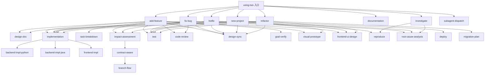

# TWS Skill 调用关系图

> 人类浏览用。Agent 运行期查找路径和依赖时优先读 `SKILL-INDEX.md` 表格，避免不必要的图结构占用上下文。

```mermaid
graph TD
    A[using-tws 入口] --> B[add-feature]
    A --> C[fix-bug]
    A --> D[hotfix]
    A --> E[new-project]
    A --> F[refactor]
    A --> G[documentation]
    A --> H[investigate]

    B --> I[design-doc]
    B --> J[impact-assessment]
    B --> K[task-breakdown]
    B --> L[implementation]
    B --> M[test]
    B --> N[code-review]
    B --> O[design-sync]
    B --> GV[goal-verify]
    B --> VP[visual-prototype]
    B --> UD[frontend-ui-design]

    C --> P[reproduce]
    C --> Q[root-cause-analysis]
    C --> L
    C --> M
    C --> N
    C --> J
    C --> O

    D --> Q
    D --> L
    D --> M
    D --> O

    E --> I
    E --> L
    E --> M
    E --> O
    E --> R[deploy]
    E --> VP
    E --> UD

    F --> S[migration-plan]
    F --> L
    F --> M
    F --> J
    F --> O
    F --> UD

    H --> P
    H --> Q

    L --> T[backend-impl-python]
    L --> U[backend-impl-java]
    L --> V[frontend-impl]

    A --> W[subagent-dispatch]

    J --> X[contract-aware]
    X --> Y[branch-flow]
```
