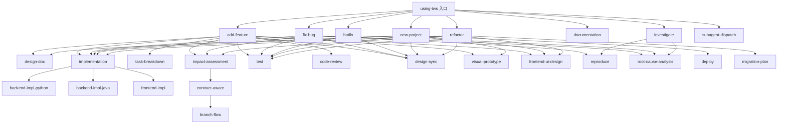

# TWS Skill 索引

> 全系统 skill 一览，含依赖关系和引用图。
> 维护入口：新增或修改 skill 时同步更新此文件。

## 调用关系图

## 入口

| Skill | 路径 | 功能 |
|-------|------|------|
| using-tws | `using-tws/SKILL.md` | 场景判断 + 路由 + 全局纠错 |
| tws-init | `init/SKILL.md` | 项目初始化，规约推断 |

---

## 流程（7 条）

| Skill | 路径 | 调用组件 |
|-------|------|---------|
| flow-add-feature | `flow-add-feature/SKILL.md` | design-doc, frontend-ui-design（条件：涉及前端）, impact-assessment, task-breakdown, implementation, test, code-review, design-sync, visual-prototype |
| flow-fix-bug | `flow-fix-bug/SKILL.md` | reproduce, root-cause-analysis, implementation, test, impact-assessment, design-sync |
| flow-hotfix | `flow-hotfix/SKILL.md` | root-cause-analysis, implementation, test, design-sync |
| flow-new-project | `flow-new-project/SKILL.md` | design-doc, frontend-ui-design（条件：涉及 UI）, implementation, test, design-sync, deploy, visual-prototype |
| flow-refactor | `flow-refactor/SKILL.md` | migration-plan, frontend-ui-design（条件：涉及 UI）, implementation, test, design-sync, impact-assessment |
| flow-documentation | `flow-documentation/SKILL.md` | （手动审计） |
| flow-investigate | `flow-investigate/SKILL.md` | reproduce, root-cause-analysis |

---

## 组件（23 个）

| Skill | 路径 | 被哪些流程调用 |
|-------|------|--------------|
| backend-api-design | `comp-backend-api-design/SKILL.md` | 通用 |
| arch-decision | `comp-arch-decision/SKILL.md` | 人类项目经理调用 |
| backend-db-design | `comp-backend-db-design/SKILL.md` | 通用 |
| backend-impl-python | `comp-backend-impl-python/SKILL.md` | 通用 |
| backend-impl-java | `comp-backend-impl-java/SKILL.md` | 通用 |
| backend-test | `comp-backend-test/SKILL.md` | 通用 |
| code-review | `comp-code-review/SKILL.md` | 通用 |
| deploy | `comp-deploy/SKILL.md` | flow-new-project |
| design-doc | `comp-design-doc/SKILL.md` | flow-add-feature, flow-new-project |
| design-sync | `comp-design-sync/SKILL.md` | 所有流程 |
| frontend-impl | `comp-frontend-impl/SKILL.md` | 通用 |
| frontend-test | `comp-frontend-test/SKILL.md` | 通用 |
| frontend-ui-design | `comp-frontend-ui-design/SKILL.md` | flow-add-feature（条件：涉及前端）、flow-new-project（条件：涉及 UI）、flow-refactor（条件：涉及 UI） |
| goal-verify | `comp-goal-verify/SKILL.md` | flow-add-feature（完整路径，触发条件下） |
| impact-assessment | `comp-impact-assessment/SKILL.md` | flow-add-feature, flow-refactor, flow-fix-bug |
| implementation | `comp-implementation/SKILL.md` | 所有流程 |
| migration-plan | `comp-migration-plan/SKILL.md` | flow-refactor |
| reproduce | `comp-reproduce/SKILL.md` | flow-fix-bug, flow-investigate |
| root-cause-analysis | `comp-root-cause-analysis/SKILL.md` | flow-fix-bug, flow-investigate, flow-hotfix |
| comp-subagent-dispatch | `comp-subagent-dispatch/SKILL.md` | 通用（Solo 和 Team 模式） |
| task-breakdown | `comp-task-breakdown/SKILL.md` | flow-add-feature |
| test | `comp-test/SKILL.md` | 所有流程 |
| visual-prototype | `comp-visual-prototype/SKILL.md` | 通用 |

---

## 基础（4 个）

| Skill | 路径 | 功能 |
|-------|------|------|
| artifact-split | `found-artifact-split/SKILL.md` | 文档/代码拆分规则，决定何时拆、怎么拆 |
| core-principles | `found-core-principles/SKILL.md` | TWS 全局规则详细说明，子 agent 按需读取 |
| review-methodology | `found-review-methodology/SKILL.md` | 审查方法论，审查必须新开子 agent |
| review-triage | `found-review-triage/SKILL.md` | 审查报告分类和叫停规则 |

---

## SUBAGENT-STOP 标签说明

`<SUBAGENT-STOP>` 标签标记**子 agent 不应直接触发的 skill**：

| 有 SUBAGENT-STOP | 没有 SUBAGENT-STOP |
|-----------------|-------------------|
| 入口 skill（using-tws） | 所有组件 skill（design-doc, implementation, test 等）|
| 流程 skill（flow-add-feature, flow-fix-bug 等） | 所有基础 skill（artifact-split, core-principles 等）|
| 调度 skill（team-subagent-dispatch） | — |
| 部分 team skill | — |
| 组件 skill 中的人类专用（arch-decision） | — |

设计意图：主 agent 管理流程编排，子 agent 只执行具体任务。SUBAGENT-STOP 在 flow/entry skill 上保护子 agent 不走错路，component/foundation skill 不加是因为子 agent 正需要它们。

---

## 团队（5 个）

| Skill | 路径 | 触发条件 |
|-------|------|---------|
| team-branch-flow | `team-branch-flow/SKILL.md` | CONTRACTS.md 存在 |
| team-contract-aware | `team-contract-aware/SKILL.md` | CONTRACTS.md 存在 |
| team-environment-gov | `team-environment-gov/SKILL.md` | 所有模式生效 |
| team-impact-report | `team-impact-report/SKILL.md` | 所有模式生效 |
| team-subagent-dispatch | `team-subagent-dispatch/SKILL.md` | 所有模式生效 |
