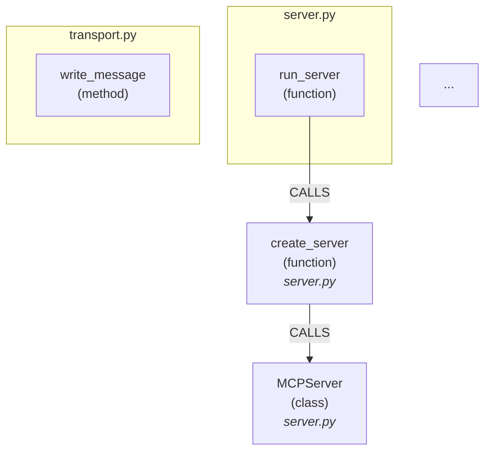
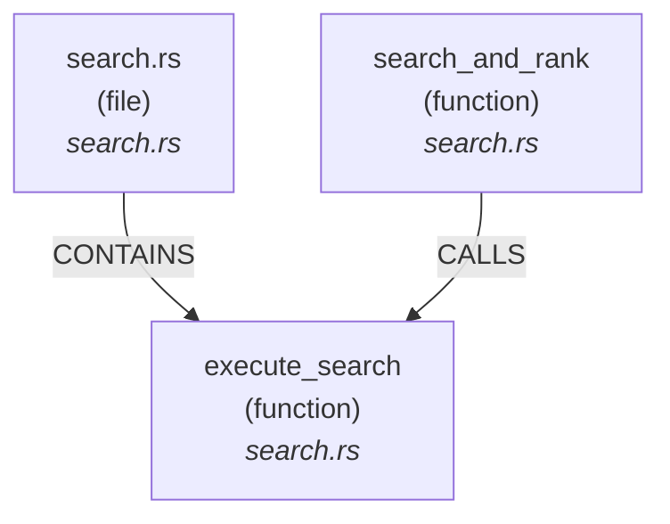
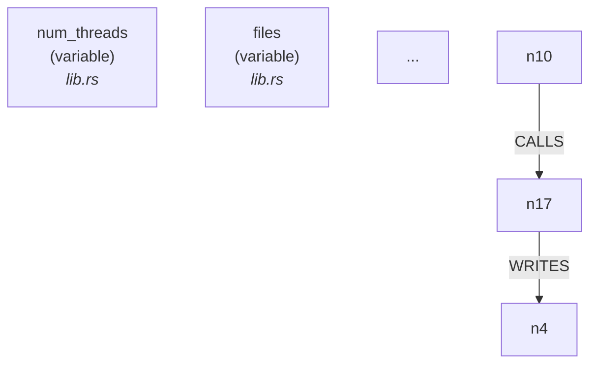
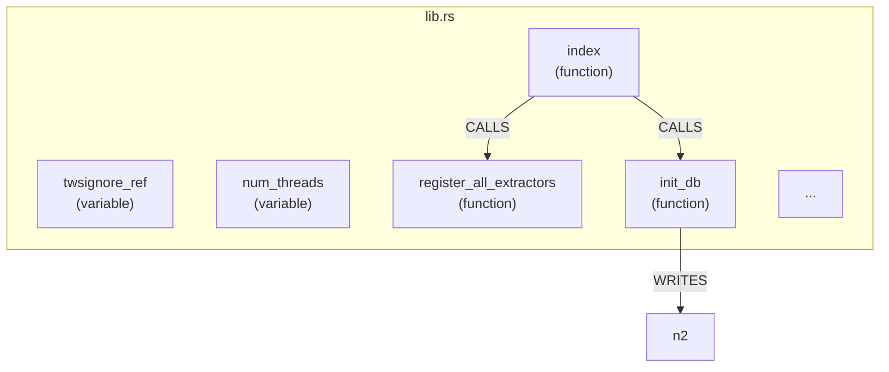
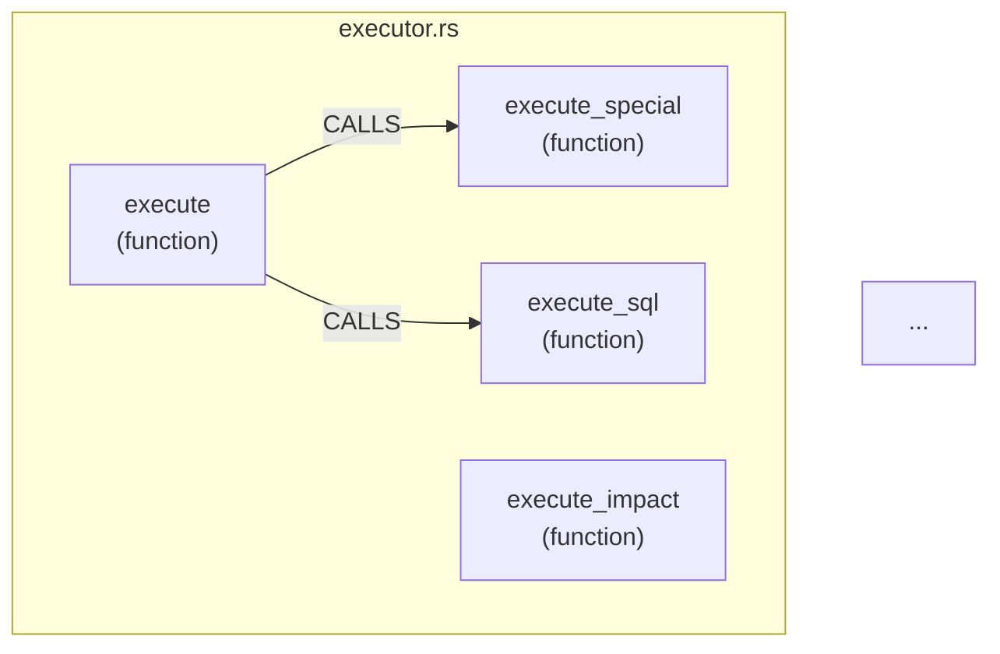
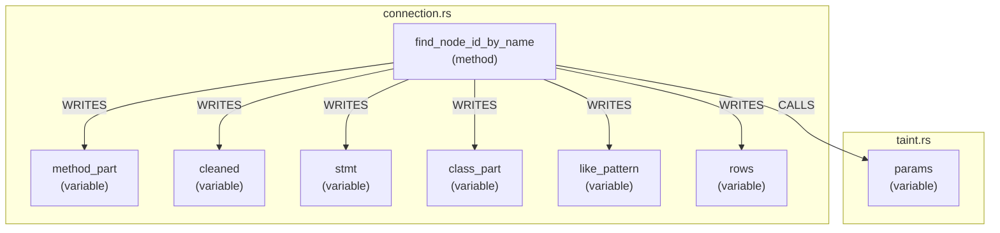

# tws-graph 用户手册 v7.3.3

> 面向人类的完整 CLI + MCP 工具参考。Agent 使用指南见 `found-tws-graph-usage`。

---

## 目录

- **1. 概述**
  - 1.1 是什么
  - 1.2 与 grep 的本质区别
  - 1.3 典型使用场景
  - 1.4 当前版本
- **2. 安装与初始化**
  - 2.1 简化流程（大多数用户）
  - 2.2 完整流程（手工部署或新服务器）
- **3. 核心概念**
  - 3.1 符号节点
  - 3.2 关系边
  - 3.3 索引数据库
  - 3.4 index vs resolve：两个阶段，缺一不可
  - 3.5 Kind 类型速览
  - 3.6 通用过滤选项：--include 和 --exclude
- **4. CLI 命令详解**
  - 4.1 索引与同步 (index / sync / hooks / watch)
  - 4.2 符号搜索 (search)
  - 4.3 调用关系 (calls)
  - 4.4 影响分析 (impact)
  - 4.5 路径追踪 (trace)
  - 4.6 跨文件解析 (resolve & unresolved)
  - 4.7 快照与差异 (snapshot & diff)
  - 4.8 图导出 (export dot/mermaid/json)
  - 4.9 架构分析 (cycles / layers / metrics / health)
  - 4.10 安全与预测 (taint / analyze / predict-impact)
  - 4.11 工具命令 (serve / lint / lsp / federate)
- **5. MCP 工具参考**
  - 5.1 什么是 MCP
  - 5.2 启动方式
  - 5.3 工具列表（21 工具）
  - 5.4 资源列表（3 资源）
- **6. 实战工作流**
  - 场景 1：接手新项目，快速理解代码结构
  - 场景 2：修改核心函数前，评估影响范围
  - 场景 3：排查跨文件调用链 Bug
  - 场景 4：重构前架构健康检查
  - 场景 5：Code Review 辅助
- **7. 故障排查**
- **附录 A：Kind 类型完整注册表**
- **附录 B：EdgeKind 完整参考**
- **附录 C：Search Qualifier 参考**

---


## 1. 概述

### 1.1 是什么

tws-graph 是一个**代码地图**。它不是 grep 的替代品，而是在 grep **之上**的一层抽象——预先用 tree-sitter 分析项目里所有代码文件，把每个类、函数、方法、变量（统称"符号"）以及它们之间的关系（谁调了谁、谁继承了谁）存进一个 SQLite 数据库。之后你想查任何东西，不再是"在文件夹里搜字符串"，而是"在数据库里查关系"。

举个例子，如果你想了解 `execute_search` 这个函数被谁调用、它又调了谁：

```
$ tws-graph calls execute_search --inbound

Callers for 'execute_search':
  1 (search.rs):file @ tws-graph/rust_core/src/query/search.rs
  1 (search_and_rank):function @ tws-graph/rust_core/src/query/search.rs
```

这就是**关系查询**——你问的不是"哪行代码出现了 `execute_search`"，而是"谁调用了 `execute_search`"。grep 给你 50 行匹配结果，其中有 45 行是注释、日志和字符串字面量。tws-graph 给你两条精确答案。

### 1.2 与 grep 的本质区别

| | grep | tws-graph |
|---|---|---|
| **找什么** | 文本字符串出现的位置 | 代码符号之间的关系 |
| **问"谁调了谁"** | 做不到——只能搜名字，不知道语义 | `tws-graph calls <符号>` |
| **问"改这里会影响哪里"** | 做不到——无法追踪依赖链 | `tws-graph impact <符号>` |
| **问"这两个符号怎么连起来的"** | 做不到——不知道调用图 | `tws-graph trace A B` |
| **过滤条件** | 文件名、行号 | 符号类型（kind）、语言（lang）、文件路径、语义相关性 |
| **适合什么** | 搜注释、日志消息、非代码文本 | 理解代码结构、分析调用关系、评估变更影响 |

换句话说：**grep 告诉你字符串在哪，tws-graph 告诉你代码是怎么组织在一起的。**

### 1.3 典型使用场景

**接手新项目，快速理解代码结构。** 第一天进项目，不知道有哪些模块、谁依赖谁。跑一条 `tws-graph search kind:module`，立刻看到所有模块列表；跑 `tws-graph cycles` 看有没有循环依赖，几分钟就能建立心智模型。

**改代码前，评估影响范围。** 你要改 `BaseExtractor.process_file()` 的签名。直接改？万一有 20 个地方调用它呢。先跑 `tws-graph impact BaseExtractor.process_file --depth 2`，看到所有直接和间接依赖者，心中有数再动手。

**排查跨文件 Bug。** 一个函数报错了，但报错点不是根因——是上游传了错误数据。grep 只能顺着一个文件一个文件翻，tws-graph 用 `tws-graph trace <入口> <报错函数>` 直接画出从入口到报错点的完整调用路径。

**架构审查。** 设计书说"模块 A 不能直接调模块 C"，实际代码里有没有违规？`tws-graph layers` 自动检测层次违规，比人工 review 快 10 倍且不会漏。

### 1.4 当前版本

```
$ tws-graph --version
tws-graph 7.3.3
```

版本号取自此项目的 `pyproject.toml`。tws-graph 从 v7.0.0 起已从纯 Python 重写为 **Rust 核心 + Python CLI 包装**，核心引擎（索引器、查询引擎、图算法）全部使用 Rust 实现，通过 PyO3 作为原生库暴露给 Python。

---

## 2. 安装与初始化

### 2.1 简化流程（大多数用户）

如果你用的是已配置好的 TWS-Skills 仓库，绝大多数工作已自动化。核心三步：

```bash
# 1. 安装 Python CLI 包
pip install -e tws-graph/

# 2. 首次构建索引（提取所有代码符号和关系）
tws-graph index

# 3. 解析跨文件引用（连接跨文件的调用关系）
tws-graph resolve
```

这三步完成后，你的 `.tws/codegraph/` 下就有了一个完整的代码符号关系数据库。之后日常使用由 git hooks 自动维护索引，你只需要查询。

### 2.2 完整流程（手工部署或新服务器）

以下是完整的端到端初始化流程，涵盖从裸机到可用的每一步。

#### 前置条件

- **Python >= 3.10**
- **Rust 工具链**（rustc + cargo）。安装方式：
  - Linux/macOS: `curl --proto '=https' --tlsv1.2 -sSf https://sh.rustup.rs | sh`
  - Windows: 访问 https://rustup.rs/
- **C/C++ 编译工具链**（tree-sitter 解析器需要 C 编译器）：
  - Linux: `sudo apt install build-essential`
  - macOS: `xcode-select --install`
  - Windows: Visual Studio Build Tools 或 `rustup default stable-msvc`

验证前置条件：

```bash
$ python --version
Python 3.10.x  （或更高）

$ rustc --version && cargo --version
rustc 1.x.x (...)
cargo 1.x.x (...)
```

#### 步骤一：安装 Python 包

```bash
pip install -e tws-graph/
```

此命令以可编辑模式安装 tws-graph Python CLI。安装后 `tws-graph` 命令可用，但因为 Rust 核心尚未部署，此时运行任何命令都会报 ImportError——这是**正常现象**，继续下一步即可。

#### 步骤二：编译 Rust 核心

```bash
cd tws-graph/rust_core
cargo build --release
```

首次构建会下载约 200+ 个 crates 依赖，耗时 5-15 分钟（取决于机器性能和网络）。构建产物位于 `target/release/`：

- Windows: `_core.dll`
- Linux: `lib_core.so`
- macOS: `lib_core.dylib`

后续增量编译会快得多。`target/` 目录约 4-5G，是纯构建缓存，可以事后删除不影响使用。

#### 步骤三：部署原生库

将编译产物复制到 Python 的 site-packages 目录，让 Python 能够 `import _core._core`：

```bash
# 确定 Python 扩展模块后缀
python -c "import sysconfig; print(sysconfig.get_config_var('EXT_SUFFIX'))"
# 示例输出: .cp312-win_amd64.pyd (Windows) 或 .cpython-312-x86_64-linux-gnu.so (Linux)

# 确定 site-packages 路径
python -c "import site; print(site.getsitepackages()[0])"

# 创建 _core 包目录并部署
PKG_DIR=$(python -c "import site; print(site.getsitepackages()[0])")/_core
mkdir -p "$PKG_DIR"
echo 'from ._core import *' > "$PKG_DIR/__init__.py"

# 复制编译产物（注意：按 EXT_SUFFIX 重命名）
# Windows:
cp tws-graph/rust_core/target/release/_core.dll "$PKG_DIR/_core$(python -c "import sysconfig; print(sysconfig.get_config_var('EXT_SUFFIX'))")"
# Linux: 替换 _core.dll 为 lib_core.so
# macOS: 替换 _core.dll 为 lib_core.dylib
```

验证部署：

```bash
$ python -c "from _core._core import ping; print(ping())"
pong
```

看到 `pong` 说明 Rust 核心部署成功。如果看到 `ImportError`，检查文件是否复制到正确位置、文件名是否与 EXT_SUFFIX 匹配。

> **提示**：如果你通过 `tws-graph-init` 技能执行初始化，步骤一到三会被自动化处理。上述详细步骤主要是给需要手工部署或排查问题的用户参考。

#### 步骤四：构建索引

```bash
tws-graph index
```

此命令用 tree-sitter 扫描项目中所有源文件，提取每个符号（类、函数、方法、变量等）及其基本信息（名称、类型、文件位置、行号）。索引数据库写入 `.tws/codegraph/index.db`。

输出示例（典型格式）：

```
Indexing 500 files...
[========================================] 500/500
  Nodes: 18423
  Edges: 45678
  Files: 500
  Duration: 12.3s
```

索引通过 28+ 个 tree-sitter 提取器覆盖 30+ 种语言和配置格式，包括 Python、TypeScript、JavaScript、Java、Go、Rust、Kotlin、PHP、Ruby、C、C++、C#、Scala、Elixir、Haskell、Clojure、Lua、Bash、HTML、CSS、Markdown、YAML、TOML、JSON、HCL/Terraform、SQL、Dockerfile、Kubernetes、Proto 等。

如果部分文件解析失败（不支持的语言、语法错误等），继续即可，不影响已成功索引的部分。如果全部失败，检查 Python 和 Rust 核心是否都正确安装。

> **.twsignore 文件（可选）**：在项目根目录创建 `.twsignore`，写入要排除的 glob pattern（格式与 `.gitignore` 一致），索引时会自动跳过匹配的文件。常用于排除 `node_modules/`、`tests/`、`*.log` 等。

#### 步骤五：解析跨文件引用（重要）

```bash
tws-graph resolve
```

这是**极其关键的一步**，很多新用户会忽略它。原因是：

- `tws-graph index` 只做**单文件**符号提取。它知道 `file_a.py` 中定义了类 `Foo`，也知道 `file_b.py` 中有一行 `from .file_a import Foo` 和一处 `Foo().bar()` 调用，但它**不知道** `file_b.py` 中的 `Foo` 引用指向的是 `file_a.py` 中的 `Foo` 定义。
- `tws-graph resolve` 扫描所有跨文件边（import、call、type reference 等），通过 21 种语言的模块解析规则，把每条边从"引用了一个叫 `Foo` 的东西"更新为"引用的是 `file_a.py` 第 42 行的 `Foo` 类定义"。

**没有 resolve 的后果**：`tws-graph calls` 只能看到同文件内的调用关系，跨文件的调用链是断的。`tws-graph impact` 无法追踪跨文件的依赖。`tws-graph trace` 几乎找不到跨文件路径。换句话说，你的代码地图只有每个房间内部的路线，没有连接房间的走廊。

输出示例（典型格式）：

```
Resolving cross-file references...
  Resolved: 12340
  Unresolved: 567
  Duration: 2.1s
```

未解析的引用会被自动分类为 `[external]`（外部 SDK/库，如 `os`、`re`、`fastapi`，这是正常的）和 `[internal]`（项目内符号但因动态调用等原因未能解析，需要手动追踪）。用 `tws-graph unresolved` 查看详情。

#### 步骤六：创建基线快照

```bash
tws-graph snapshot initial
```

将当前索引数据库的快照保存为 `.tws/codegraph/index-initial.db`。这个基线有两个用途：
1. 后续改代码后，用 `tws-graph diff initial` 对比变更，做设计同步
2. 如果后续索引损坏或误操作，可以从基线恢复

#### 步骤七：安装 git hooks

```bash
tws-graph hooks install
```

安装三个 git hooks：
- **post-commit**：每次 commit 后自动增量索引新提交的变更
- **post-merge**：每次 merge/pull 后自动增量索引引入的变更
- **post-checkout**：每次切换分支后自动重建索引

安装后，你不再需要手动跑 `tws-graph index`——索引和代码库自动保持同步。

#### 步骤八：验证完整安装

```bash
$ tws-graph --version
tws-graph 7.3.3

$ python -c "from _core._core import ping; print(ping())"
pong

$ tws-graph search kind:class | head -5
找到 20 个结果:
  Greeter [class] (scala) tws-graph/tests/fixtures/scala/Sample.scala:10
  BM25 [class] (python) comp-frontend-ui-design/scripts/core.py:104
  DesignSystemGenerator [class] (python) comp-frontend-ui-design/scripts/design_system.py:37
  ComplexityMetrics [class] (python) tws-graph/src/tws_graph/analysis/complexity.py:23
  ComplexityAnalyzer [class] (python) tws-graph/src/tws_graph/analysis/complexity.py:522
```

三行都正常输出，说明工具链安装完整、索引已构建、查询功能可用。

---

## 3. 核心概念

tws-graph 的世界观很简单：代码由**节点**和**边**组成，全存在一个**本地数据库**里。下面用实际命令和输出解释每个概念。

### 3.1 符号节点

每个类、函数、方法、变量……都是图中的一个**节点**（Node）。节点有四个基本属性：

- **name**：符号名（如 `execute_search`、`MCPServer`）
- **kind**：符号类型（如 `class`、`function`、`method`）
- **lang**：编程语言（如 `python`、`rust`）
- **位置**：文件路径 + 行号

`tws-graph search` 就是你在按任意条件查询节点。

例子——查项目中所有函数：

```
$ tws-graph search kind:function

找到 20 个结果:
  walk_node [function] (rust) tws-graph/rust_core/src/indexer/extractors/bash.rs:88
  extract_function [function] (rust) tws-graph/rust_core/src/indexer/extractors/bash.rs:124
  extract_command [function] (rust) tws-graph/rust_core/src/indexer/extractors/bash.rs:194
  walk_all_children [function] (rust) tws-graph/rust_core/src/indexer/extractors/clojure.rs:322
  walk_children [function] (rust) tws-graph/rust_core/src/indexer/extractors/csharp.rs:115
  extract_namespace [function] (rust) tws-graph/rust_core/src/indexer/extractors/csharp.rs:179
  extract_class [function] (rust) tws-graph/rust_core/src/indexer/extractors/csharp.rs:209
  execute_search [function] (rust) tws-graph/rust_core/src/query/search.rs:49
  search_and_rank [function] (rust) tws-graph/rust_core/src/query/search.rs:97
  run_search_parsed [function] (rust) tws-graph/rust_core/src/query/mod.rs:192
  ...
```

例子——查名字含 "parse" 的函数：

```
$ tws-graph search kind:function parse

找到 20 个结果:
  _parse [function] (python) tws-graph/tests/cypher/test_parser.py:47
  parse [function] (rust) tws-graph/rust_core/src/gql/parser.rs:369
  _parse_frontmatter [function] (python) tws-graph/src/tws_graph/indexer/skill_parser.py:43
  parse_cli_args [function] (rust) tws-graph/rust_core/src/cli/mod.rs:...
  ...
```

例子——查 Rust 中的 struct：

```
$ tws-graph search kind:struct

找到 20 个结果:
  ComplexityMetrics [struct] (rust) tws-graph/rust_core/src/analysis/complexity.rs:8
  EntryPoint [struct] (rust) tws-graph/rust_core/src/analysis/entry_point.rs:15
  ChangeRegion [struct] (rust) tws-graph/rust_core/src/analysis/git_diff.rs:103
  ImpactPrediction [struct] (rust) tws-graph/rust_core/src/analysis/impact_prediction.rs:11
  ModuleMetrics [struct] (rust) tws-graph/rust_core/src/analysis/metrics.rs:13
  Database [struct] (rust) tws-graph/rust_core/src/db/connection.rs:22
  ...
```

每条结果都在告诉你：**这是什么**（kind）、**在哪**（文件:行号）、**用哪种语言写的**（lang）。你拿到的不再是一个字符串匹配位置，而是一个有类型的代码符号。

### 3.2 关系边

节点之间的连线叫**边**（Edge），表示一个符号和另一个符号的关系。tws-graph 支持 24 种边类型，最常用的有：

- **CALLS**：A 调用了 B（函数/方法调用）
- **IMPORTS**：A 导入了 B（模块导入）
- **REFERENCES**：A 引用了 B（一般符号引用）
- **EXTENDS**：A 继承了 B（类继承）
- **IMPLEMENTS**：A 实现了 B（接口实现）
- **CONTAINS**：A 包含 B（如文件包含类、类包含方法）

这些边构成了代码的关系骨架。用 `tws-graph export mermaid` 可以可视化这些关系。

例子——看 `MCPServer` 类有哪些内部方法和关系：

```
$ tws-graph export mermaid --from MCPServer --depth 2

graph TD
  n0["MCPServer<br/>(class)<br/><i>server.py</i>"]
  n1["_register_tools<br/>(method)<br/><i>server.py</i>"]
  n3["StdioTransport<br/>(class)<br/><i>transport.py</i>"]
  n30["_handle_request<br/>(method)<br/><i>server.py</i>"]

  n0 -->|CONTAINS| n28["__init__<br/>(method)<br/><i>server.py</i>"]
  n28 -->|CALLS| n3
  n28 -->|CALLS| n13["ToolRegistry<br/>(class)<br/><i>registry.py</i>"]
  n28 -->|CALLS| n1
  n0 -->|CONTAINS| n1
  n0 -->|CONTAINS| n30
  n10["JsonRpcRequest<br/>(class)<br/><i>protocol.py</i>"] -->|EXTENDS| n21["JsonRpcMessage<br/>(class)<br/><i>protocol.py</i>"]
  ...
```

这个图告诉我们：`MCPServer` 包含 `__init__`、`_register_tools`、`_handle_request` 等方法（CONTAINS 边）；`__init__` 调用了 `StdioTransport` 和 `ToolRegistry`（CALLS 边）；`JsonRpcRequest` 继承自 `JsonRpcMessage`（EXTENDS 边）。所有这些关系都是 tree-sitter 从源码中**静态分析**提取出来的，不需要运行代码。

用 `-g` 参数可以将节点按文件分组：

```
$ tws-graph export mermaid --from run_server -m -g



每个 subgraph 框代表一个文件，箭头表示调用关系。一眼能看出 `run_server` 调用了哪些文件里的哪些类和方法。

### 3.3 索引数据库

所有节点和边存储在一个文件里：

```
.tws/codegraph/index.db
```

这是一个标准的 SQLite 数据库文件。纯本地，零网络依赖，不需要任何外部服务。你可以用任何 SQLite 客户端打开它查看内部结构，但日常使用通过 tws-graph 命令就够了。

数据库的核心表结构（简化）：

- **nodes**：所有符号节点（id, name, kind, language, file_path, line, ...）
- **edges**：所有关系边（source_id, target_id, kind, ...）
- **unresolved_refs**：尚未解析的跨文件引用
- **snapshots**：快照元数据

FTS5 全文索引加持，`search` 命令的查询速度是毫秒级。

### 3.4 index vs resolve：两个阶段，缺一不可

这可能是 tws-graph 中最容易混淆的概念。用比喻来解释：

想象一个图书馆有两项工作要完成：

**index（索引）** = 给每本书单独建一个目录。翻开一本书，把每章的标题、小节标题、页码都摘出来。工作完成后，你知道《Python 实战》的第 3 章叫"函数"，从第 42 页开始。但你还不知道第 3 章里引用了《设计模式》第 5 章的内容——因为那涉及两本不同的书。

**resolve（解析）** = 把不同书之间的引用串起来。扫描所有书中出现的"详见 XX 书第 Y 章"，然后去对应的书里找到那一章，把引用关系建立起来。完成后，你知道《Python 实战》第 42 页引用了《设计模式》第 120 页。

代码世界的对应关系：

| 概念 | index | resolve |
|------|-------|---------|
| **做什么** | 扫描每个文件，提取其中定义的所有符号 | 扫描所有跨文件引用边，解析引用目标 |
| **能看到什么** | 文件 A 定义了类 `Foo`，文件 B 调用了 `Foo()` | 文件 B 中的 `Foo()` 调用指向文件 A 第 42 行的 `Foo` 类 |
| **calls 结果** | 只有同文件内的调用关系 | 完整的跨文件调用链 |
| **impact 结果** | 只有同文件内的依赖 | 完整的跨文件依赖闭包 |

**核心规则**：`tws-graph index` 之后**必须**跟 `tws-graph resolve`，否则跨文件查询不完整。

### 3.5 Kind 类型速览

`kind` 是 `search` 命令最常用的过滤条件，它表示符号的"类别"。以下是常用的 kind：

| kind | 含义 | 示例 |
|------|------|------|
| `class` | 类 | `tws-graph search kind:class parser` |
| `function` | 函数/独立函数 | `tws-graph search kind:function parse` |
| `method` | 方法（类成员函数） | `tws-graph search kind:method connect` |
| `module` | 模块/命名空间 | `tws-graph search kind:module sample` |
| `interface` | 接口/协议 | `tws-graph search kind:interface plugin` |
| `struct` | 结构体（Rust/C/Go 等） | `tws-graph search kind:struct config` |
| `enum` | 枚举 | `tws-graph search kind:enum status` |
| `variable` | 变量/属性 | `tws-graph search kind:variable timeout` |

每种语言支持的 kind 不完全相同。例如 `interface` 在 TypeScript/Java/PHP 中常用，但在 Python 中不存在（Python 用 ABC 或 Protocol）；`struct` 在 Rust 中是核心概念，但在 Python 中不会出现。

除了通用编程语言的 kind，tws-graph 还为结构式语言提供了专属 kind：

- **SQL**：`sql_table`、`sql_index`、`sql_view`、`sql_query`
- **Dockerfile**：`dockerfile`、`dockerfile_stage`
- **HCL/Terraform**：`hcl_resource`、`hcl_data`、`hcl_module`、`hcl_provider`、`hcl_variable`
- **YAML**：`yaml_key`、`yaml_document`
- **Kubernetes**：`k8s_resource`
- **Markdown**：`md_heading`、`md_code_block`、`md_link`
- **CSS**：`css_rule`、`css_import`

完整的 kind 注册表（40+ 种，每种语言支持的 kind 列表）见手册附录。

### 3.6 通用过滤选项：--include 和 --exclude

从 v7.2.0 起，**几乎所有命令**都支持 `--include`（`-I`）和 `--exclude`（`-X`），让你在不改 `.twsignore` 的情况下临时过滤范围。

**`--exclude` / `-X`**：排除匹配的文件/目录。最常用的场景是排除测试目录。

```
# 查所有函数实现，但不看测试文件里的
$ tws-graph search kind:function --exclude "tests/"

找到 13 个结果:
  walk_node [function] (rust) tws-graph/rust_core/src/indexer/extractors/bash.rs:88
  extract_function [function] (rust) tws-graph/rust_core/src/indexer/extractors/bash.rs:124
  extract_command [function] (rust) tws-graph/rust_core/src/indexer/extractors/bash.rs:194
  walk_all_children [function] (rust) tws-graph/rust_core/src/indexer/extractors/clojure.rs:322
  walk_children [function] (rust) tws-graph/rust_core/src/indexer/extractors/csharp.rs:115
  ...
```

不使用 `--exclude` 时，测试文件中的函数（如 `test_xxx`）可能会淹没真正的实现。开发时查实现，**总是加上 `--exclude "tests/"`**。

**`--include` / `-I`**：限定只搜索匹配的文件/目录。

```
# 只看 src/ 下的类定义
$ tws-graph search kind:class --include "src/**"

找到 17 个结果:
  ComplexityMetrics [class] (python) tws-graph/src/tws_graph/analysis/complexity.py:23
  ComplexityAnalyzer [class] (python) tws-graph/src/tws_graph/analysis/complexity.py:522
  ConfigLink [class] (python) tws-graph/src/tws_graph/analysis/config_links.py:45
  ...
```

**组合使用**：`--include` 和 `--exclude` 可以同时作用，先缩小范围再排除。

```
# 在 src/ 下找类，但排除测试辅助类
$ tws-graph search kind:class --include "src/**" --exclude "tests/"
```

> **注意**：`--include` 和 `--exclude` 使用 glob pattern，与 `.gitignore` 语法一致。支持 `*`（单层通配）、`**`（多层通配）、`?`（单字符通配）。

---

## 4. CLI 命令详解

tws-graph 7.3.3 提供 25 个 CLI 子命令，覆盖索引构建、符号搜索、关系查询、影响分析、架构分析、导出和工具等多个维度。本章按使用频率和功能类别依次介绍每个命令。

### 4.1 索引与同步 (index / sync / hooks / watch)

索引是 tws-graph 的基础。只有索引构建完成后，后续的搜索、调用关系查询、影响分析等命令才能正常工作。

#### index — 全量/增量索引

**一句话用途**：扫描项目源文件，用 tree-sitter 提取符号（类、函数、方法等）和关系（调用、继承、实现等），写入 SQLite 索引数据库。

```
tws-graph index --help
```

输出（关键参数）：

| 参数 | 说明 |
|-----|------|
| `[PROJECT_PATH]` | 项目根目录，默认 `.` |
| `--force` | 强制全量重建（跳过 content-hash 缓存检查） |
| `--deep` | 深度分析模式，额外检测代码克隆（`similar_to` 边），耗时较长 |
| `--db TEXT` | 索引数据库路径，默认 `项目目录/.tws/codegraph/index.db` |
| `--twsignore TEXT` | 自定义 `.twsignore` 忽略文件路径 |
| `--include/-I TEXT` | 包含匹配 glob 的文件（可重复指定） |
| `--exclude/-X TEXT` | 排除匹配 glob 的文件（可重复指定） |

**常用示例**：

```bash
# 全量索引（首次使用或重建）
tws-graph index

# 强制全量重建（忽略缓存）
tws-graph index --force

# 深度分析（包含代码克隆检测）
tws-graph index --deep

# 限定索引范围：只索引 src/ 目录，排除 tests/ 和 node_modules/
tws-graph index --include "src/**" --exclude "tests/" --exclude "node_modules/"

# 串行提取模式（调试/对比用）
TWS_USE_PARALLEL=0 tws-graph index
```

**实际输出示例**：

执行 `tws-graph sync` 的输出：

```
增量同步: D:\TWS-Skills
  同步完成: 432 文件, 18292 节点, 55655 关系, 耗时 8462ms
```

> `index` 和 `sync` 输出格式相同，均包含文件数、节点数、关系数和耗时。

#### sync — 增量同步

**一句话用途**：基于文件 stat（修改时间）预筛选，只重新索引有变更的文件，比 `index` 更快。

```bash
tws-graph sync
```

**实际输出示例**：

```
增量同步: D:\TWS-Skills
  同步完成: 432 文件, 18292 节点, 55655 关系, 耗时 8462ms
```

> 如果没有文件变更，sync 会立即返回，耗时远小于 index。

#### index vs sync 的选择

| 场景 | 用哪个 | 原因 |
|------|--------|------|
| 首次使用，还没有索引库 | `index` | 需要从头构建 |
| 索引数据库损坏或查询结果明显不对 | `index --force` | 全量重建确保干净状态 |
| git hooks 已安装，日常开发 | 无需手动操作 | hooks 自动维护 |
| 子 agent 刚修改了代码但还没 commit | `sync` | 更快，只重索引变更文件 |
| 添加了大量新文件（超过几百个） | `index` | 批量索引效率更高 |
| 需要深度分析（克隆检测） | `index --deep` | sync 不包含深度分析 |

> **核心原则**：hooks 已安装时不需要手动索引。只有在 hooks 未安装或刚修改代码尚未 commit 时才需要手动操作。

#### hooks — Git 钩子管理

**一句话用途**：安装/移除 git hooks，在每次 commit、merge、checkout 时自动增量同步索引。

```bash
tws-graph hooks install    # 安装 hooks
tws-graph hooks status     # 查看 hooks 状态
tws-graph hooks remove     # 卸载 TWS 安装的 hooks
```

**实际输出示例 — `tws-graph hooks status`**：

```
Hooks status:
  post-commit: installed (264 bytes)
  post-merge: installed (267 bytes)
  post-checkout: installed (441 bytes)
```

三个 hooks 的作用：

| Hook | 触发时机 | 作用 |
|------|---------|------|
| `post-commit` | 每次 git commit 之后 | 将本次提交的新增/修改文件同步到索引 |
| `post-merge` | 每次 git merge/pull 之后 | 将合并引入的变更同步到索引 |
| `post-checkout` | 每次 git checkout 之后 | 将切换分支后的文件变更同步到索引 |

> 安装 hooks 后，索引会自动保持最新状态。你不再需要手动运行 `tws-graph index` 或 `tws-graph sync`。

#### watch — 文件监听自动同步

**一句话用途**：启动文件变更监听器，检测到文件修改后自动执行增量同步（基于轮询）。

```bash
tws-graph watch                          # 默认：监听当前目录，2 秒轮询间隔
tws-graph watch --path . --interval 3.0  # 自定义路径和轮询间隔
tws-graph watch --debounce-ms 500        # 自定义去抖动窗口（默认 300ms）
```

**参数**：

| 参数 | 默认值 | 说明 |
|------|--------|------|
| `--path` | `.` | 监听的目录 |
| `--interval` | `2.0` | 轮询间隔（秒） |
| `--debounce-ms` | `300` | 去抖动窗口（毫秒），同一时间段内的多次变更合并为一次同步 |
| `--json` | 关闭 | JSON Lines 格式输出 |

> **使用场景**：当你需要持续编辑代码且尚未配置 git hooks 时，`watch` 可以替代 hooks 保持索引更新。但在已有 hooks 的常规开发流程中，不需要同时运行 watch。

### 4.2 符号搜索 (search)

`search` 是最常用的命令。它基于 FTS5 全文搜索引擎，在符号名称、文件路径和类型标签中进行模糊匹配。

#### 基本语法

```bash
tws-graph search <关键词> [--limit N] [--exclude GLOB] [--include GLOB] [--semantic] [--json]
```

#### 基本搜索：关键词匹配

```bash
tws-graph search search
```

**实际输出**：

```
找到 5 结果:
  execute_search [function] (rust) tws-graph/rust_core/src/query/search.rs:49
  SearchQuery [struct] (rust) tws-graph/rust_core/src/query/search.rs:16
  search.py [file] (python) comp-frontend-ui-design/scripts/search.py:1
  search_and_rank [function] (rust) tws-graph/rust_core/src/query/search.rs:97
  search.rs [file] (rust) tws-graph/rust_core/src/query/search.rs:1
```

每条结果包含：**符号名** `[类型]` `(语言)` **文件路径** : **行号**。

> 默认最多返回 20 条结果，可用 `--limit/-n` 调整上限。

#### qualifier 过滤

`search` 支持三种 qualifier，用于精确缩小搜索范围：

| qualifier | 语法 | 示例 |
|-----------|------|------|
| `kind:` | 按符号类型过滤 | `kind:function`, `kind:class`, `kind:method` |
| `lang:` | 按编程语言过滤 | `lang:python`, `lang:rust`, `lang:sql` |
| `path:` | 按文件路径片段过滤 | `path:src/auth`, `path:rust_core` |

多个 qualifier 用空格分隔，逻辑为 AND（同时满足）。普通关键词也会参与 AND 逻辑。

#### kind: — 按符号类型过滤

```bash
tws-graph search kind:class graph
```

**实际输出**：

```
找到 20 结果:
  GraphTraverser [class] (python) tws-graph/src/tws_graph/graph/traversal.py:20
  GraphAlgorithm [class] (python) tws-graph/src/tws_graph/graph/algorithms/base.py:27
  GraphDiffusionSignal [class] (python) tws-graph/src/tws_graph/search/signals.py:423
  GraphCentralitySignal [class] (python) tws-graph/src/tws_graph/search/signals.py:600
  AlgorithmResult [class] (python) tws-graph/src/tws_graph/graph/algorithms/base.py:12
  CentralityComputer [class] (python) tws-graph/src/tws_graph/graph/algorithms/centrality.py:35
  MinHash [class] (python) tws-graph/src/tws_graph/graph/algorithms/minhash.py:58
  LSHIndex [class] (python) tws-graph/src/tws_graph/graph/algorithms/minhash.py:135
  CloneDetector [class] (python) tws-graph/src/tws_graph/graph/algorithms/similarity.py:23
  DiffReport [class] (python) tws-graph/src/tws_graph/diff.py:18
  ... (共 20 条)
```

> `kind:` 的完整注册表包含 40+ 种符号类型。详见 `found-tws-graph-usage` skill 中的 kind 注册表。

#### lang: — 按语言过滤

```bash
tws-graph search lang:python kind:class graph
```

**输出**：同上例（因为 `kind:class` 已经筛选了 Python 的 graph 相关类）。

再来一个有区分度的例子 —— 搜索 Rust 中的 lint 函数：

```bash
tws-graph search lang:rust kind:function lint
```

**实际输出**：

```
找到 20 结果:
  lint_skills [function] (rust) tws-graph/rust_core/src/lint.rs:254
  test_lint_invalid_prefix [function] (rust) tws-graph/rust_core/src/lint.rs:430
  test_lint_missing_frontmatter [function] (rust) tws-graph/rust_core/src/lint.rs:446
  test_lint_unreferenced_skill [function] (rust) tws-graph/rust_core/src/lint.rs:478
  test_lint_valid_flow_skill [function] (rust) tws-graph/rust_core/src/lint.rs:380
  test_lint_cross_reference_warning [function] (rust) tws-graph/rust_core/src/lint.rs:462
  test_lint_missing_subagent_stop_on_flow [function] (rust) tws-graph/rust_core/src/lint.rs:398
  lint_skills [function] (rust) tws-graph/rust_core/src/lib.rs:1357
  test_lint_subagent_stop_on_comp_is_error [function] (rust) tws-graph/rust_core/src/lint.rs:414
  parse_frontmatter [function] (rust) tws-graph/rust_core/src/lint.rs:27
  check_frontmatter [function] (rust) tws-graph/rust_core/src/lint.rs:89
  check_prefix [function] (rust) tws-graph/rust_core/src/lint.rs:212
  get_layer_prefix [function] (rust) tws-graph/rust_core/src/lint.rs:60
  ... (共 20 条)
```

#### path: — 按文件路径过滤

```bash
tws-graph search path:rust_core kind:function parse
```

**实际输出**：

```
找到 20 结果:
  parse [function] (rust) tws-graph/rust_core/src/gql/parser.rs:369
  test_parse_impact [function] (rust) tws-graph/rust_core/src/gql/parser.rs:574
  test_parse_calls [function] (rust) tws-graph/rust_core/src/gql/parser.rs:600
  test_parse_trace [function] (rust) tws-graph/rust_core/src/gql/parser.rs:640
  test_parse_find_simple [function] (rust) tws-graph/rust_core/src/gql/parser.rs:387
  test_parse_find_full [function] (rust) tws-graph/rust_core/src/gql/parser.rs:449
  test_parse_calls_qualified [function] (rust) tws-graph/rust_core/src/gql/parser.rs:612
  test_parse_calls_inbound [function] (rust) tws-graph/rust_core/src/gql/parser.rs:624
  ... (共 20 条)
```

> 与不使用 `path:` 的对比：之前 `tws-graph search kind:function parse` 返回的结果中混杂了 Python 文件（如 `tws-graph/tests/cypher/test_parser.py` 和 `tws-graph/src/tws_graph/indexer/skill_parser.py`）。加上 `path:rust_core` 后，结果全部限定在 Rust 核心代码路径内。

#### --exclude "tests/" — 排除测试文件

这是最容易被忽视但最重要的搜索技巧之一。

**不加 `--exclude "tests/"`**：

```bash
tws-graph search kind:function parse
```

输出 20 条结果（全部列出）：

```
找到 20 结果:
  _parse [function] (python) tws-graph/tests/cypher/test_parser.py:47
  parse [function] (rust) tws-graph/rust_core/src/gql/parser.rs:369
  test_parse_impact [function] (rust) tws-graph/rust_core/src/gql/parser.rs:574
  test_parse_calls [function] (rust) tws-graph/rust_core/src/gql/parser.rs:600
  test_parse_trace [function] (rust) tws-graph/rust_core/src/gql/parser.rs:640
  _parse_frontmatter [function] (python) tws-graph/src/tws_graph/indexer/skill_parser.py:43
  test_parse_find_simple [function] (rust) tws-graph/rust_core/src/gql/parser.rs:387
  test_parse_find_full [function] (rust) tws-graph/rust_core/src/gql/parser.rs:449
  test_parse_calls_qualified [function] (rust) tws-graph/rust_core/src/gql/parser.rs:612
  test_parse_calls_inbound [function] (rust) tws-graph/rust_core/src/gql/parser.rs:624
  test_parse_trace_qualified [function] (rust) tws-graph/rust_core/src/gql/parser.rs:652
  test_parse_trailing_garbage [function] (rust) tws-graph/rust_core/src/gql/parser.rs:674
  test_parse_unknown_keyword [function] (rust) tws-graph/rust_core/src/gql/parser.rs:680
  parseInfoField [function] (go) tws-graph/tests/fixtures/go/sample.go:132
  parse_frontmatter [function] (rust) tws-graph/rust_core/src/lint.rs:27
  ... (共 20 条)
```

**加 `--exclude "tests/"`**：

```bash
tws-graph search kind:function parse --exclude "tests/"
```

输出 18 条结果（去掉了 2 条来自 tests/ 的测试函数）：

```
找到 18 结果:
  parse [function] (rust) tws-graph/rust_core/src/gql/parser.rs:369
  test_parse_impact [function] (rust) tws-graph/rust_core/src/gql/parser.rs:574
  test_parse_calls [function] (rust) tws-graph/rust_core/src/gql/parser.rs:600
  test_parse_trace [function] (rust) tws-graph/rust_core/src/gql/parser.rs:640
  _parse_frontmatter [function] (python) tws-graph/src/tws_graph/indexer/skill_parser.py:43
  test_parse_find_simple [function] (rust) tws-graph/rust_core/src/gql/parser.rs:387
  test_parse_find_full [function] (rust) tws-graph/rust_core/src/gql/parser.rs:449
  test_parse_calls_qualified [function] (rust) tws-graph/rust_core/src/gql/parser.rs:612
  ... (共 18 条)
```

**差异分析**：

| 维度 | 不加 `--exclude "tests/"` | 加 `--exclude "tests/"` |
|------|--------------------------|------------------------|
| 返回数量 | 20 | 18 |
| 删除项 | — | `_parse` (test_parser.py), `parseInfoField` (fixtures/go/sample.go) |

> **为什么排除测试目录很重要？** 当搜索代码实现时（特别是查函数/方法签名），测试文件中对生产代码的调用会产生大量同名节点（如 `test_parse_*`）。不加过滤时，大量 `test_*` 函数会占据前 20 条结果，真正的业务实现 `parse` 和 `_parse_frontmatter` 被淹没在噪音中。`--exclude "tests/"` 帮你快速聚焦于生产代码。

#### --semantic 选项：语义搜索

```bash
tws-graph search --semantic "authentication handler"
```

`--semantic` 启用 11-signal 融合排序，在 FTS5 BM25 预过滤之后，按以下 11 个维度加权排序：

| # | 信号 | 说明 |
|---|------|------|
| 1 | BM25 | 经典关键词相关性 |
| 2 | Qualified Name Match | 完全限定名匹配 |
| 3 | Docstring Match | 文档字符串匹配 |
| 4 | AST Similarity | AST 结构相似度 |
| 5 | API Signature Similarity | API 签名相似度 |
| 6 | Clone Similarity | 代码克隆相似度 |
| 7 | Module Proximity | 模块邻近度 |
| 8 | Graph Diffusion | 图扩散信号 |
| 9 | Caller/Callee Proximity | 调用者/被调用者邻近度 |
| 10 | Graph Centrality | 图中心性 |
| 11 | Dataflow Connection | 数据流连接 |

> **何时用**：自然语言描述想找什么但不知道确切符号名时（如 "authentication handler"），语义搜索能发现关键词匹配不到的语义相关符号。
>
> **何时不用**：知道确切的符号名或首选用 qualifier 精确过滤时，普通搜索更快更精确。

#### search 命令小结

| 任务 | 命令 |
|------|------|
| 查所有符号 | `tws-graph search <关键词>` |
| 按类型过滤 | `tws-graph search kind:function auth` |
| 按语言过滤 | `tws-graph search lang:python kind:class user` |
| 按路径过滤 | `tws-graph search path:src/ kind:method parse` |
| 排除测试 | `tws-graph search kind:function parse --exclude "tests/"` |
| 语义搜索 | `tws-graph search --semantic "authentication handler"` |
| 叠加过滤 | `tws-graph search kind:method auth --exclude "tests/" --include "src/"` |

### 4.3 调用关系 (calls)

`calls` 查询符号的调用关系，回答两个方向的问题：
- **默认（--inbound）**：谁调了我？
- **--outbound**：我调了谁？

#### 基本语法

```bash
tws-graph calls <符号> [--inbound] [--outbound] [--depth N] [--exclude GLOB] [--json]
```

> 默认行为是 `--inbound`（谁调了我），不需要显式指定。这意味着直接执行 `tws-graph calls <符号>` 就是查调用者。

#### 查谁调了我（默认=inbound）

```bash
tws-graph calls lint_skills
```

**实际输出**：

```
Callers for 'lint_skills':
  1 (lib.rs):file @ tws-graph/rust_core/src/lib.rs
  1 (verify_fixes.py):file @ tws-graph/rust_core/verify_fixes.py
  1 (lint):function @ tws-graph/src/tws_graph/cli.py
  1 (rust_lint):function @ tws-graph/src/tws_graph/rust_bridge.py
```

解读：`lint_skills` 被 4 个位置调用——2 个文件和 2 个函数。

另一个例子：

```bash
tws-graph calls parse_frontmatter
```

**实际输出**：

```
Callers for 'parse_frontmatter':
  1 (lint.rs):file @ tws-graph/rust_core/src/lint.rs
  1 (check_frontmatter):function @ tws-graph/rust_core/src/lint.rs
  1 (test_parse_valid_frontmatter):function @ tws-graph/rust_core/src/lint.rs
  1 (test_parse_missing_frontmatter):function @ tws-graph/rust_core/src/lint.rs
```

#### 查我调了谁（--outbound）

```bash
tws-graph calls parse_frontmatter --outbound
```

**实际输出**：

```
Calls for 'parse_frontmatter':
  1 (lines):variable @ tws-graph/rust_core/src/lint.rs
  1 (name):variable @ tws-graph/rust_core/src/lint.rs
  1 (description):variable @ tws-graph/rust_core/src/lint.rs
  1 (end_idx):variable @ tws-graph/rust_core/src/lint.rs
```

解读：`parse_frontmatter` 函数内部访问了 4 个变量（lines、name、description、end_idx）。

#### --depth 参数：多跳追踪

`--depth N` 控制追踪的跳数（默认 1）。

```bash
tws-graph calls ComplexityAnalyzer.analyze --outbound
```

**实际输出**（depth=1，深度 1 跳）：

```
Calls for 'ComplexityAnalyzer.analyze':
  1 (Store):class @ tws-graph/src/tws_graph/store/interface.py
  1 (get_all_files):method @ tws-graph/src/tws_graph/store/interface.py
  1 (get):method @ tws-graph/rust_core/src/resolver/language/mod.rs
  1 (read):method @ tws-graph/src/tws_graph/mcp/registry.py
  1 (_map_lang_to_ts):function @ tws-graph/src/tws_graph/analysis/complexity.py
  1 (parse):method @ tws-graph/rust_core/src/gql/parser.rs
  1 (encode):method @ tws-graph/src/tws_graph/search/embeddings/model.py
  1 (_find_function_nodes):method @ tws-graph/src/tws_graph/analysis/complexity.py
  1 (_node_text):function @ tws-graph/src/tws_graph/analysis/complexity.py
  1 (analyze_node):method @ tws-graph/src/tws_graph/analysis/complexity.py
```

#### Class.method 记法（v7.3.1 新增）

从 v7.3.1 开始，`calls` 支持 `ClassName.method_name` 格式直接定位类方法：

```bash
tws-graph calls "ComplexityAnalyzer.analyze"
```

输出同上。

> 此记法同样适用于 `impact` 和 `trace` 命令。

### 4.4 影响分析 (impact)

`impact` 评估修改某个符号后可能造成的影响范围 -- 谁依赖这个符号（直接或间接），影响会传播多远。

#### 基本语法

```bash
tws-graph impact <符号> [--depth N] [--exclude GLOB] [--json]
```

> 默认深度为 2（2 跳依赖传播）。

#### 基本使用

```bash
tws-graph impact parse_frontmatter --depth 1
```

**实际输出**：

```
Impact of 'parse_frontmatter' (depth 1):
  tws-graph/rust_core/src/lint.rs (4 items):
    - name (variable)
    - lines (variable)
    - end_idx (variable)
    - description (variable)
```

解读：修改 `parse_frontmatter` 直接影响同一文件 `lint.rs` 中的 4 个变量（name、lines、end_idx、description），因为 `parse_frontmatter` 向这些变量写入解析结果。任何调用方读取这些变量都会受到影响。

#### --depth 参数示例

```bash
tws-graph impact lint_skills --depth 2
```

**实际输出**：

```
Impact of 'lint_skills' (depth 2):
  tws-graph/rust_core/src/db/models.rs (1 items):
    - json (variable)
  tws-graph/rust_core/src/lib.rs (9 items):
    - out (variable)
    - warnings (variable)
    - errors (variable)
    - json_issues (variable)
    - skill_file_count (variable)
    - output (variable)
    - files (variable)
    - use_json (variable)
    - issues (variable)
```

影响半径 = 2 跳，共影响 2 个文件中的 10 个符号。

#### Class.method 记法 + --depth 2

```bash
tws-graph impact ComplexityAnalyzer.analyze --depth 2
```

**实际输出**（完整）：

```
Impact of 'ComplexityAnalyzer.analyze' (depth 2):
  tws-graph/rust_core/src/gql/parser.rs (2 items):
    - parse (method)
    - stmt (variable)
  tws-graph/rust_core/src/indexer/extractors/groovy.rs (1 items):
    - walk (function)
  tws-graph/src/tws_graph/analysis/complexity.py (11 items):
    - _compute_cyclomatic (method)
    - _find_function_nodes (method)
    - _compute_risk_level (function)
    - _find_func_def (method)
    - _compute_halstead_counts (method)
    - _map_lang_to_ts (function)
    - ComplexityMetrics (class)
    - _node_text (function)
    - _get_func_body (method)
    - _compute_cognitive (method)
    - analyze_node (method)
  tws-graph/tests/mcp/test_registry.py (1 items):
    - handler (function)
  tws-graph/src/tws_graph/mcp/registry.py (1 items):
    - read (method)
  tws-graph/src/tws_graph/store/interface.py (2 items):
    - get_all_files (method)
    - Store (class)
  tws-graph/src/tws_graph/search/embeddings/model.py (2 items):
    - _run_inference (method)
    - encode (method)
  tws-graph/rust_core/src/resolver/language/mod.rs (1 items):
    - get (method)
```

影响覆盖 8 个文件中的 21 个符号，包括 Rust 和 Python 代码。

#### 输出解读

- **直接依赖**：depth=1 时列出的符号，这些符号直接与被分析符号有调用/写入关系
- **间接依赖**：depth=2 时扩展到第二跳的符号（直接依赖的依赖）
- **风险等级**：影响的文件数越多、跨文件范围越广，风险越高。agent 应根据影响半径判断修改的波及面

> **提示**：`impact` 命令与 `calls --inbound` 的区别：
> - `calls --inbound` 只查谁直接调用了这个符号（1 跳）
> - `impact` 可以传播多跳，展示完整的依赖闭包，更适合评估修改风险

### 4.5 路径追踪 (trace)

`trace` 查找两个符号之间是否存在调用路径 -- 从起点出发，沿着调用链到达终点。

#### 基本语法

```bash
tws-graph trace <起点符号> <终点符号> [--json] [--exclude GLOB]
```

#### 直接调用路径

```bash
tws-graph trace check_frontmatter parse_frontmatter
```

**实际输出**：

```
Trace from 'check_frontmatter' to 'parse_frontmatter':
check_frontmatter -> parse_frontmatter
```

解读：`check_frontmatter` 直接调用 `parse_frontmatter`，单跳路径。

#### 间接调用路径

```bash
tws-graph trace ComplexityAnalyzer.analyze parse
```

**实际输出**：

```
Trace from 'ComplexityAnalyzer.analyze' to 'parse':
analyze -> parse
```

解读：`ComplexityAnalyzer.analyze` 方法内部调用了 `parse` 方法，单跳路径。

#### 无路径的情况

```bash
tws-graph trace index sync
```

**实际输出**：

```
No path found from 'index' to 'sync'
```

解读：`index` 和 `sync` 在调用图中没有可达路径——它们是独立的入口函数，不存在调用关系。

#### trace 的组合使用

`trace` 常与其他命令配合使用：

1. **先用 `search` 找起点和终点**：`tws-graph search kind:function auth` 找到相关函数
2. **再用 `calls --inbound` 找入口**：`tws-graph calls auth_handler --inbound` 找到谁调用了它
3. **最后用 `trace` 验路径**：`tws-graph trace main auth_handler` 确认完整调用链

### 4.6 跨文件解析 (resolve & unresolved)

索引构建后，大量的引用（import、call、type reference）可能指向其他文件中的符号，这些引用需要跨文件解析才能转换为实际的关系边。`resolve` 和 `unresolved` 协同完成这个任务。

#### resolve — 执行跨文件解析

**一句话用途**：扫描所有边中的 target 名称，在索引节点中查找匹配的符号，解析成功则更新边的 target，失败则写入 unresolved_refs 表。

```bash
tws-graph resolve
```

**实际输出**：

```
跨文件引用解析结果:
  解析成功: 12240
  无法解析: 16303
  无效:     0
  外部符号: 2882
```

**输出字段说明**：

| 字段 | 含义 |
|------|------|
| 解析成功 | 找到目标符号并完成链接的引用数 |
| 无法解析 | 在所有索引节点中未找到匹配符号的引用数（进一步分为外部符号和项目内未解析） |
| 无效 | 引用格式错误或目标节点不存在 |
| 外部符号 | 被识别为外部 SDK/库的引用（如 `os`, `re`, `typer`），这种无法解析是正常的 |

#### unresolved — 列出未解析引用

**一句话用途**：列出 `resolve` 之后仍然未解决的引用，自动标记 `[internal]` 或 `[external]`，帮助判断哪些需要手动处理。

```bash
tws-graph unresolved
```

**实际输出**：

```
Unresolved references:
  [internal] trim (CALLS) @ tws-graph/tests/fixtures/clojure/Sample.clj
  [internal] split (CALLS) @ tws-graph/tests/fixtures/clojure/Sample.clj
  [internal] join (CALLS) @ tws-graph/tests/fixtures/clojure/Sample.clj
  [internal] println (CALLS) @ tws-graph/tests/fixtures/scala/Sample.scala
  [internal] println (CALLS) @ tws-graph/tests/fixtures/scala/Sample.scala
  [internal] name.is_empty (CALLS) @ tws-graph/rust_core/src/indexer/extractors/bash.rs
  [internal] ctx.add_node (CALLS) @ tws-graph/rust_core/src/indexer/extractors/bash.rs
  [internal] node.child_by_field_name (CALLS) @ tws-graph/rust_core/src/indexer/extractors/bash.rs
  [internal] cmd_name.is_empty (CALLS) @ tws-graph/rust_core/src/indexer/extractors/bash.rs
  [internal] ctx.make_qualified (CALLS) @ tws-graph/rust_core/src/indexer/extractors/bash.rs
  [internal] db::hash_id (CALLS) @ tws-graph/rust_core/src/indexer/extractors/bash.rs
  ...
```

#### [internal] vs [external] 标签的含义

| 标签 | 含义 | 行动策略 |
|------|------|---------|
| `[internal]` | 项目内符号，因索引缺失、动态调用、宏展开等原因未能解析 | **回退 grep**，用 Grep 工具在项目中手动搜索该符号名 |
| `[external]` | 外部 SDK/库（如 `os`, `re`, `typer`, `fastapi`），不在项目源码中 | **停止追踪**，这类引用无法解析是正常的 |

**典型使用流程**：

```bash
# 1. 执行跨文件解析
tws-graph resolve

# 2. 查看未解析的引用
tws-graph unresolved

# 3. 对 [internal] 引用，回退手动追踪
#    grep -r "symbol_name" /path/to/project

# 4. 对 [external] 引用，忽略或查阅文档
```

#### 为什么 resolve 是必须的

1. **索引构建只捕获文本级别的引用，不会自动链接到目标**。tree-sitter 提取器识别 `import foo.bar` 和 `bar.Baz()`，但不会自动将 `bar.Baz` 链接到 `Baz` 类定义。`resolve` 完成这个链接。

2. **不执行 resolve 则所有跨文件调用关系都不可查询**。`tws-graph search` 能找到函数定义，但 `tws-graph calls func --inbound` 返回空——因为调用者与被调用者之间的边还没有建立。

3. **resolve 的 external 分类防止浪费时间**。2882 个外部引用中绝大多数是标准库和第三方库，标记为 `[external]` 后你可以快速跳过，只关注项目内的 `[internal]` 引用。

> **最佳实践**：在 git hooks 中配置 `tws-graph sync && tws-graph resolve`，确保每次代码变更后索引和解析都保持最新。hooks 安装后这两步会自动执行，无需手动干预。

---

### 4.7 快照与差异 (snapshot & diff)

快照功能允许冻结当前索引状态的完整副本，之后可通过 diff 命令对比两个快照之间的差异。这是 tws-graph 设计同步工作流的核心支撑：**改代码前拍快照，改后对比，确保所有变更可追溯**。

#### 创建快照

```bash
tws-graph snapshot <名称>
```

快照名可以是任意字符串，建议使用有意义的命名（如 `before-refactor`、`v7.3.2-baseline`）。

示例：

```bash
$ tws-graph snapshot checkpoint-demo
Snapshot 'checkpoint-demo' created.
```

#### 列出所有快照

不加参数直接运行 `tws-graph diff`，会列出当前所有已存在的快照：

```bash
$ tws-graph diff
Snapshots:
  - checkpoint-demo
  - initial
```

`initial` 是首次 `tws-graph index` 时自动创建的基线快照。

#### 对比快照

```bash
tws-graph diff <快照A> <快照B>
```

对比两个快照，输出新增、删除、变更的节点和文件数量。示例：

```bash
$ tws-graph diff checkpoint-demo initial --brief
Snapshot diff: checkpoint-demo -> initial
  +0 added, -0 removed, ~0 changed, =15027 unchanged
  Files: +0 new, -0 deleted
```

输出解读：
- `+0 added` -- 新快照中新增的节点数
- `-0 removed` -- 新快照中被移除的节点数
- `~0 changed` -- 发生变更的节点数
- `=15027 unchanged` -- 未变化的节点数

#### --brief 与 --json 选项

**`--brief`**：仅输出汇总统计，不列出具体差异条目。适合快速确认"有没有变化"。

**`--json`**：以 JSON 格式输出，包含每个被移除/新增/变更节点的详细信息，适合脚本处理或 CI 管道：

```bash
$ tws-graph diff checkpoint-demo initial --json
Snapshot diff: checkpoint-demo -> initial
  Summary: +0 added, -3262 removed, ~0 changed, =15027 unchanged

  Removed:
    - test_extract_class_import_creates_references_edge (function)
    - test_extract_named_import_creates_references (function)
    - test_infer_groovy_module_deep_nested (function)
    - test_resolve_relative_import_dotdot_sibling (function)
    - qualify_ruby_call (function)
    - test_import_java_classes (function)
    ...
```

#### 典型工作流

```bash
# 1. 修改代码前拍快照
tws-graph snapshot before-refactor

# 2. 修改代码（手动或子 agent 执行）
# ...

# 3. 修改后重新索引
tws-graph index

# 4. 拍新快照并对比
tws-graph snapshot after-refactor
tws-graph diff before-refactor after-refactor

# 5. 查看具体改了什么文件
tws-graph diff before-refactor after-refactor --brief
```

---

### 4.8 图导出 (export dot/mermaid/json)

`tws-graph export` 支持三种导出格式：DOT（Graphviz）、Mermaid（Markdown 友好）和 JSON（结构化数据）。这是 v7.3.3 重点改进的功能，特别是 Mermaid 格式新增了 `-m`（Markdown 代码块包裹）和 `-g`（按文件分组 subgraph）参数。

#### 4.8.1 DOT 格式

输出 Graphviz DOT 语言，可用 `dot`、`neato` 等工具渲染为 SVG/PNG：

```bash
tws-graph export dot --from <符号> --depth <层数>
tws-graph export dot --to <符号> --depth <层数>    # 反向遍历：谁调了该符号
```

> **互斥规则**：`--from` 和 `--to` 只能指定一个，不能同时使用。`--from` 正向遍历出边（该符号调了谁），`--to` 反向遍历入边（谁调了该符号）。

示例（从 `index` 函数出发，展开 2 层深度）：

```bash
$ tws-graph export dot --from index --depth 2
digraph G {
  rankdir=LR;
  node [shape=box, style=rounded];

  "e5bdf3c7edcf2da2" [label="chunk_size\n(variable)"];
  "37063ef1264456bb" [label="num_threads\n(variable)"];
  "7d83e8b4473f506e" [label="register_all_extractors\n(function)"];
  "ad1df8e83646be58" [label="path\n(variable)"];
  "ff48546406c0616a" [label="db\n(variable)"];
  "832506d8653dd590" [label="index\n(function)"];
  "32b984d624961d5d" [label="exc\n(variable)"];
  "9d0cb03574427eee" [label="twsignore_opt\n(variable)"];
  "db59f75133bf51c4" [label="conn\n(variable)"];
  "745c73291e046396" [label="total_edges\n(variable)"];
  "948f6f7f540b393f" [label="insert_edge\n(variable)"];
  ...
}
```

每个节点以 hash ID 标识，label 标注了符号名和类型（如 `function`、`variable`）。可直接保存为 `.dot` 文件后用 Graphviz 渲染。

#### 4.8.2 Mermaid 格式（重点）

Mermaid 是 Markdown 原生支持的图表语言，在 GitHub、GitLab、Notion 等平台可直接渲染。tws-graph 的 Mermaid 导出专为 Markdown 设计文档优化。

##### 基本用法

```bash
tws-graph export mermaid --from <符号> [--depth <层数>]
tws-graph export mermaid --to <符号> [--depth <层数>]     # 反向遍历：谁调了该符号
```

> **互斥规则**：`--from` 和 `--to` 只能指定一个，不能同时使用。`--from` 正向遍历出边（该符号调了谁），`--to` 反向遍历入边（谁调了该符号）。

正向遍历示例：

```bash
$ tws-graph export mermaid --from index --depth 2
graph TD
  n0["num_threads<br/>(variable)<br/><i>lib.rs</i>"]
  n1["files<br/>(variable)<br/><i>lib.rs</i>"]
  n2["empty<br/>(variable)<br/><i>lib.rs</i>"]
  n3["register_all_extractors<br/>(function)<br/><i>lib.rs</i>"]
  n4["path<br/>(variable)<br/><i>lib.rs</i>"]
  ...

  n17 -->|WRITES| n4
  n10 -->|CALLS| n17
  n10 -->|WRITES| n5
  n10 -->|WRITES| n7
  n10 -->|CALLS| n3
  ...
```

节点标签会自动附加文件名（以斜体显示），如 `<i>lib.rs</i>`，方便快速定位。

**反向遍历示例**（使用 `--to`，查看谁调了指定符号）：

```bash
$ tws-graph export mermaid --to execute_search --depth 1 -m

```

`--to` 模式遍历入站边（谁调了、谁包含了该符号），与 `--from` 的遍历方向相反。

##### -m 参数：包裹 Markdown 代码块

添加 `-m` 后，输出会自动包裹在 ```` ```mermaid  ```` 代码块中，可直接复制粘贴到 `.md` 文件，无需手动添加：

```bash
$ tws-graph export mermaid --from index --depth 2 -m

```

> 注意：末尾的 ` ``` ` 会自动闭合，整个输出直接粘贴到 Markdown 文件中即可渲染为图表。

##### -g 参数：按文件分组 subgraph

`-g` 参数会根据源文件将节点分组为 Mermaid `subgraph`，同文件的符号在视觉上聚合在一起。这在展示模块内部结构时特别有用：

```bash
$ tws-graph export mermaid --from index --depth 2 -g
graph TD
  subgraph "lib.rs"
    n0["registry<br/>(variable)"]
    n1["path<br/>(variable)"]
    n2["twsignore_opt<br/>(variable)"]
    n3["insert_node<br/>(variable)"]
    n14["init_db<br/>(function)"]
    n20["register_all_extractors<br/>(function)"]
    n21["index<br/>(function)"]
    ...
  end

  n14 -->|WRITES| n1
  n21 -->|CALLS| n14
  n21 -->|CALLS| n20
  ...
```

##### -m -g 组合使用

两个参数可以组合，同时获得代码块包裹和文件分组：

```bash
$ tws-graph export mermaid --from index --depth 2 -m -g

```

##### 边类型标注

Mermaid 图中每条边都会标注关系类型，方便理解节点间的关系本质：

| 边标注 | 含义 |
|--------|------|
| `-->|CALLS|` | 函数/方法调用 |
| `-->|WRITES|` | 变量写入 |
| `-->|READS|` | 变量读取 |
| `-->|IMPORTS|` | 模块导入 |
| `-->|EXTENDS|` | 类继承 |
| `-->|CONTAINS|` | 包含关系 |

#### 4.8.3 JSON 格式

JSON 导出适合程序化处理或导入到其他分析工具：

```bash
tws-graph export json [--from <符号>] [--depth <层数>] [--kind <边类型>] [--limit <数量>]
```

**基本用法**（导出所有边，结果量很大，建议加 `--limit`）：

```bash
$ tws-graph export json --from index --depth 2 --limit 5
{
  "edges": [
    {
      "kind": "CALLS",
      "source": "52935786e451d5bb",
      "target": "3703d005d4e70b0b",
      "target_text": "trim"
    },
    {
      "kind": "CALLS",
      "source": "52935786e451d5bb",
      "target": "7e73209e7c4dba75",
      "target_text": "split"
    },
    {
      "kind": "CALLS",
      "source": "c0432bc71e465118",
      "target": "76d2626ccded609e",
      "target_text": "join"
    },
    ...
  ],
  "nodes": [...]
}
```

**按边类型过滤**（`--kind` 参数）：

```bash
# 只导出 CALLS 类型的边
$ tws-graph export json --kind CALLS --limit 5
{
  "edges": [
    {
      "kind": "CALLS",
      "source": "52935786e451d5bb",
      "target": "3703d005d4e70b0b",
      "target_text": "trim"
    },
    ...
  ]
}
```

> 注意：`--kind` 参数值必须使用大写的 EdgeKind 名称（如 `CALLS`、`IMPORTS`、`EXTENDS`），小写形式（如 `calls`）不会匹配到任何边。

#### 4.8.4 --include / --exclude 过滤

`export` 命令支持 `--include`/`-I` 和 `--exclude`/`-X` 参数，用于按文件路径过滤导出的范围：

```bash
# 排除测试目录
tws-graph export json --kind CALLS --exclude "tests/" --limit 5

# 只导出 tws-graph/src/ 下的调用关系
tws-graph export json --kind CALLS --include "tws-graph/src/**" --limit 5

# 复合过滤
tws-graph export mermaid --from index -m -g --exclude "tests/" --include "tws-graph/src/**"
```

---

### 4.9 架构分析 (cycles / layers / metrics / health)

tws-graph 提供四种架构质量分析命令，从不同维度评估代码库的结构健康度。

#### 4.9.1 cycles -- 循环依赖检测

检测调用图中的循环依赖。循环依赖会导致模块间强耦合，增加理解成本和重构难度。

```bash
$ tws-graph cycles
Cycles detected:
  Cycle 1: find_function_name
  Cycle 2: find_function_name
  Cycle 3: get_variable_name
  Cycle 4: find_name_in_declarator
  Cycle 5: find_name_in_declarator
  Cycle 6: get_variable_name
  Cycle 7: dfs
  Cycle 8: _find_func_def
  Cycle 9: _match_comp
  ...
  Cycle 13: analyze -> _run_p9_analyzer
  Cycle 14: analyze -> _run_p9_analyzer
  Cycle 15: _dc_to_dict
  ...
  Cycle 50: _parse_expression -> _parse_or -> _parse_xor -> _parse_and ->
            _parse_not -> _parse_comparison -> _parse_add -> _parse_mul ->
            _parse_unary -> _parse_atom -> _parse_case_expression
  ...
  Cycle 77: Add
```

每条记录表示一个自引用或循环调用的符号。部分循环是合理的（如递归解析器中的 `_evaluate` -> `_eval_binary_op` -> `_evaluate`），但跨模块的循环（如 `analyze -> _run_p9_analyzer`）值得关注。

支持 `--include`/`--exclude` 过滤：

```bash
# 排除测试目录只看源码的循环依赖
tws-graph cycles --exclude "tests/"
```

#### 4.9.2 layers -- 层次违规检测

检测架构层次（layer）之间的违规引用。tws-graph 根据符号所在目录深度自动划分层次，然后检查是否出现"低层引用高层"的违规。

```bash
$ tws-graph layers
Layer violations (189 found):
  derive_ui_reasoning (layer 14) -> lower (layer 51)
  derive_ui_reasoning (layer 14) -> lower (layer 51)
  detect_domain (layer 14) -> lower (layer 51)
  _search_csv (layer 14) -> exists (layer 51)
  search (layer 14) -> exists (layer 51)
  _sync_all.py (layer 14) -> json (layer 51)
  design_system.py (layer 14) -> json (layer 51)
  generate (layer 14) -> upper (layer 51)
  derive_ui_reasoning (layer 14) -> items (layer 51)
  ...
```

每条违规记录格式为 `调用者 (layer N) -> 目标 (layer M)`。这有助于在早期发现违反 Clean Architecture / 分层架构原则的依赖。

#### 4.9.3 metrics -- 模块内聚与耦合度量

计算每个模块（按目录分组）的内聚度（Cohesion）、耦合度（Coupling）、不稳定性（Instability）和内部/外部边数量：

```bash
$ tws-graph metrics
Module metrics:
  Module                            Nodes Cohesion Coupling  Instab. Internal External
  flow-add-feature/SKILL/              11    0.577    0.423    0.786       15       11
  tws-graph/IMPORT_RESOLUTION/         13    1.000    0.000    0.000       13        0
  flow-investigate/SKILL/              10    0.882    0.118    0.500       15        2
  comp-reproduce/SKILL/                 8    0.875    0.125    1.000        7        1
  tws-graph/rust_core/              11264    0.500    0.500    0.805    15245    15266
  comp-proposal-solution-review/SKILL/ 17    0.818    0.182    0.800       18        4
  tws-graph/src/                     1335    0.457    0.543    0.488     3614     4294
  comp-frontend-ui-design/scripts/      44    0.101    0.899    0.984       67      597
  tws-graph/tests/                   4559    0.393    0.607    0.986     5919     9145
  ...
```

指标解读：

| 指标 | 含义 | 理想值 |
|------|------|--------|
| **Cohesion** | 模块内部边占所有边的比例（0-1） | 越高越好，> 0.7 为高内聚 |
| **Coupling** | 模块与外部模块的边占所有边的比例（0-1） | 越低越好，< 0.3 为低耦合 |
| **Instability** | External / (Internal + External)，衡量模块对外部依赖的敏感度 | 0.3-0.7 之间为宜 |
| **Internal** | 模块内部边的总数 | -- |
| **External** | 模块与外部模块边的总数 | -- |

从结果中可以看出 **comp-frontend-ui-design/scripts/** 明显内聚度低（0.101）、耦合度高（0.899），值得重点关注。

#### 4.9.4 health -- 代码健康评分

综合评估每个文件的健康得分，考虑测试覆盖率、复杂度、耦合度和死代码比例：

```bash
$ tws-graph health --worst 10
Code health (worst 10 files):
  File                                        Score Coverage Complex. Coupling    Dead%
  tws-graph/rust_core/src/indexer/context.rs    0.092    0.000    1.000    0.660    0.953
  tws-graph/rust_core/src/indexer/ignore.rs    0.092    0.000    1.000    0.658    0.954
  tws-graph/rust_core/src/resolver/language/mod.rs    0.100    0.000    1.000    0.623    0.963
  tws-graph/rust_core/src/resolver/module_index.rs    0.104    0.000    1.000    0.625    0.934
  tws-graph/rust_core/src/indexer/language.rs    0.110    0.000    0.880    0.734    0.909
  tws-graph/rust_core/src/lib.rs              0.116    0.000    1.000    0.617    0.864
  tws-graph/rust_core/src/indexer/parallel.rs    0.121    0.000    1.000    0.548    0.945
  tws-graph/rust_core/src/indexer/extractors/haskell.rs    0.125    0.000    1.000    0.534    0.944
  tws-graph/rust_core/src/snapshot.rs         0.126    0.000    1.000    0.564    0.885
  tws-graph/rust_core/src/indexer/extractors/rust.rs    0.127    0.000    1.000    0.509    0.970
```

栏目解读：

| 列 | 含义 | 范围 |
|----|------|------|
| **Score** | 综合健康得分 | 0（最差）到 1（最优） |
| **Coverage** | 测试覆盖率（启发式估计） | 0-1 |
| **Complex.** | 复杂度（已归一化） | 0（低复杂度）到 1（高复杂度） |
| **Coupling** | 耦合度 | 0（低耦合）到 1（高耦合） |
| **Dead%** | 死代码比例 | 0-1 |

`--worst N` 参数按得分升序排列，显示最差的 N 个文件。配合 `--exclude` 排除非源码目录：

```bash
# 只评估 tws-graph/src 的源码健康度
tws-graph health --include "src/**" --worst 10

# 排除测试和 fixture 文件
tws-graph health --worst 10 --exclude "tests/"
```

---

### 4.10 安全与预测 (taint / analyze / predict-impact)

#### 4.10.1 taint -- 安全污点分析

污点分析追踪数据从 source（用户输入/外部来源）到 sink（危险操作/输出点）的潜在路径，用于发现注入漏洞、敏感数据泄露等安全问题：

```bash
$ tws-graph taint
Taint analysis (36 paths):
  Path 1: test_two_connected_nodes_same_community -> setup_db
  Path 2: test_two_connected_nodes_same_community -> insert_node
  Path 3: test_two_connected_nodes_same_community -> insert_node
  Path 4: test_two_connected_nodes_same_community -> detect_communities
  Path 5: execute -> execute_sql
  Path 6: diff_snapshots -> load_node_map
  Path 7: diff_snapshots -> load_node_map
  Path 8: diff_snapshots -> load_files
  Path 9: diff_snapshots -> load_files
  Path 10: test_extract_namespace -> extract
  Path 11: test_extract_namespace -> find_nodes
  Path 12: compute_total_score -> compute_qualified_name_match
  ...
  Path 36: test_scores_sorted_worst_first -> compute_health
```

过滤示例：

```bash
# 排除测试文件，只看应用代码中的污点路径
tws-graph taint --exclude "tests/"
```

#### 4.10.2 analyze -- 分析运行器

`tws-graph analyze` 是一个分析运行器框架，通过 `--run` 参数指定分析类型：

##### 死代码检测 (dead-code)

检测入度为零（无调用者）且非入口点的符号，标记为潜在死代码：

```bash
$ tws-graph analyze --run dead-code
{
  "dead-code": {
    "analyzer": "dead-code",
    "count": 7542,
    "duration_ms": 281.89,
    "result": [
      {
        "node_id": "52935786e451d5bb",
        "qualified_name": "tws-graph/tests/fixtures/clojure/Sample.clj::process-data",
        "kind": "function",
        "file_path": "tws-graph/tests/fixtures/clojure/Sample.clj",
        "language": "clojure",
        "in_degree": 0,
        "out_degree": 0,
        "is_entry_point": false,
        "centrality": null
      },
      ...
    ]
  }
}
```

> 注意：死代码检测结果包含 fixture 和测试文件。建议使用 `--exclude "tests/"` 过滤，只看应用代码中的死代码。

##### 入口点识别 (entry-point)

识别项目的入口点（`main` 函数、`__init__` 方法、CLI 入口等），按类型分类：

```bash
$ tws-graph analyze --run entry-point
{
  "entry-point": {
    "analyzer": "entry-point",
    "count": 225,
    "duration_ms": 73.25,
    "result": [
      {
        "node_id": "3f0eea6ecdf05007",
        "qualified_name": "comp-frontend-ui-design/scripts/core.py::BM25.__init__",
        "kind": "method",
        "file_path": "comp-frontend-ui-design/scripts/core.py",
        "entry_type": "init",
        "confidence": 0.9,
        "evidence": "name is '__init__'"
      },
      {
        "node_id": "1e60c49071e24168",
        "qualified_name": "tws-graph/src/tws_graph/analysis/complexity.py::ComplexityAnalyzer.__init__",
        "kind": "method",
        ...
      },
      ...
    ]
  }
}
```

每条结果包含：
- `entry_type` -- 入口点类型（`init`、`main`、`cli` 等）
- `confidence` -- 置信度（0-1）
- `evidence` -- 判定依据

##### 其他分析器

```bash
# Git diff 影响分析
tws-graph analyze --run git-diff

# 克隆检测（MinHash + LSH 算法）
tws-graph analyze --algorithm clone --threshold 0.8
```

#### 4.10.3 predict-impact -- 修改影响预测

预测修改某个符号对代码库的影响范围和风险等级：

```bash
$ tws-graph predict-impact index
Impact prediction for 'index':
  Risk level: medium
  Blast radius: 2 hops
  Estimated churn: 22 nodes
  Affected files (1):
    - tws-graph/rust_core/src/lib.rs
```

预测结果解读：

| 字段 | 含义 |
|------|------|
| **Risk level** | 风险等级：`low` / `medium` / `high` / `critical` |
| **Blast radius** | 影响半径（跳数）：受影响的节点距离目标多远 |
| **Estimated churn** | 估计变动节点数：修改可能涉及的节点总数 |
| **Affected files** | 受影响的文件列表 |

配合过滤使用：

```bash
# 排除测试文件后评估影响
$ tws-graph predict-impact index --exclude "tests/"
Impact prediction for 'index':
  Risk level: medium
  Blast radius: 2 hops
  Estimated churn: 22 nodes
  Affected files (1):
    - tws-graph/rust_core/src/lib.rs
```

---

### 4.11 工具命令 (serve / lint / lsp / federate)

#### 4.11.1 serve -- MCP 服务器

启动 MCP (Model Context Protocol) 服务器，对外暴露 21 个工具和 3 个资源，供 IDE 集成或外部 agent 调用：

```bash
tws-graph serve [--root <路径>] [--db <数据库路径>]
```

**启动服务**：

```bash
# 默认配置（当前目录 + .tws/codegraph/index.db）
tws-graph serve

# 指定项目根和数据库
tws-graph serve --root /path/to/project --db .tws/codegraph/index.db
```

**生成 Claude Code MCP 配置**：

```bash
$ tws-graph serve mcp-config
{
  "mcpServers": {
    "tws-graph": {
      "command": "tws-graph",
      "args": [
        "serve",
        "--db",
        "D:\\TWS-Skills\\.tws\\codegraph\\index.db"
      ],
      "description": "tws-graph MCP server - zero-dependency, offline-capable code symbol graph queries. 16 tools + 3 resources."
    }
  }
}
```

将此 JSON 粘贴到 `claude_desktop_config.json` 即可启用 IDE 集成。

> 注意：`tws-graph serve` 是一个常驻进程（长连接 MCP 服务器），不会自动退出。按 `Ctrl+C` 停止。

#### 4.11.2 lint -- Skill 文件校验

校验 `.tws/skills/` 下所有 SKILL.md 文件的结构完整性和规范合规性。检查 5 条规则：frontmatter（YAML 头信息）、SUBAGENT-STOP 标签、交叉引用、前缀规范、未引用检测：

```bash
$ tws-graph lint
  31 errors:
    [frontmatter] comp-backend-api-design/SKILL.md: Missing or invalid YAML frontmatter (must have name + description)
    [frontmatter] comp-backend-db-design/SKILL.md: Missing or invalid YAML frontmatter (must have name + description)
    [frontmatter] comp-backend-impl-java/SKILL.md: Missing or invalid YAML frontmatter (must have name + description)
    [frontmatter] comp-backend-impl-python/SKILL.md: Missing or invalid YAML frontmatter (must have name + description)
    [frontmatter] comp-backend-test/SKILL.md: Missing or invalid YAML frontmatter (must have name + description)
    ...
    [subagent-stop] tws-graph-init/SKILL.md: Entry/flow skill missing required <SUBAGENT-STOP> tag
    [subagent-stop] tws-init/SKILL.md: Entry/flow skill missing required <SUBAGENT-STOP> tag
    ...

  161 warnings:
    [cross-refs] comp-agentic-review-core/SKILL.md: Cross-reference to unknown skill: `found-tws-graph-usage`
    [unreferenced] comp-backend-api-design/SKILL.md: Skill is not referenced by any other skill
    [unreferenced] comp-backend-db-design/SKILL.md: Skill is not referenced by any other skill
    ...
```

错误类型说明：

| 规则 | 含义 |
|------|------|
| `frontmatter` | YAML 头信息缺失或不完整（必须含 `name` + `description`） |
| `subagent-stop` | Entry/Flow 层 skill 缺少必需的 `<SUBAGENT-STOP>` 标签 |
| `cross-refs` | 交叉引用指向不存在的 skill |
| `unreferenced` | Skill 未被任何其他 skill 引用（可能是孤立文件） |
| `prefix` | 目录名前缀与 skill 类型不匹配 |

#### 4.11.3 lsp setup -- LSP 可用性检测

检测系统上已安装的 LSP (Language Server Protocol) 服务器。在本次测试环境中，该命令存在已知 bug -- Rust 核心函数签名与 Python 调用不匹配：

```bash
$ tws-graph lsp setup
TypeError: _core._core.lsp_setup() takes no arguments (1 given)
```

> **已知问题**: `tws-graph lsp setup` 在 7.3.3 版本中，Python CLI 层向 Rust 核心函数 `lsp_setup()` 传入了一个参数，但 Rust 核心的函数签名不接受任何参数。这是 `rust_bridge.py:421` 中 `lsp_setup(db_path)` 与 `_core._core.lsp_setup()` 签名不匹配导致的问题。预计将在后续版本修复。

#### 4.11.4 federate -- 多仓库联邦

`tws-graph federate` 用于管理多仓库联邦，使 `search`/`calls`/`impact`/`trace` 命令能够跨仓库查询。操作为 `add`/`remove`/`list`：

```bash
# 语法
tws-graph federate add <路径> --name <逻辑名称>
tws-graph federate remove <逻辑名称>
tws-graph federate list
```

在本次测试环境中，该功能尚未完全实现：

```bash
$ tws-graph federate list
ModuleNotFoundError: No module named 'tws_graph.federation'
```

> **已知问题**: `tws-graph federate` 在 7.3.3 版本中，Python CLI 层尝试导入 `tws_graph.federation` 模块，但该模块尚未创建。此功能处于开发中状态。

---

### 命令速查表（4.7 — 4.11）

| 命令 | 用途 | 页码 |
|------|------|------|
| `tws-graph snapshot <name>` | 创建命名快照 | 4.7 |
| `tws-graph diff [a] [b]` | 对比快照 / 列出快照 | 4.7 |
| `tws-graph diff a b --brief` | 简要差异统计 | 4.7 |
| `tws-graph diff a b --json` | JSON 格式差异 | 4.7 |
| `tws-graph export dot --from X` | 导出 Graphviz DOT | 4.8 |
| `tws-graph export mermaid --from X` | 导出 Mermaid 图 | 4.8 |
| `tws-graph export mermaid --from X -m` | Mermaid + 代码块包裹 | 4.8 |
| `tws-graph export mermaid --from X -g` | Mermaid + 文件分组 | 4.8 |
| `tws-graph export mermaid --from X -m -g` | Mermaid + 代码块 + 分组 | 4.8 |
| `tws-graph export json --kind CALLS` | 导出 JSON（按边类型过滤） | 4.8 |
| `tws-graph cycles` | 循环依赖检测 | 4.9 |
| `tws-graph layers` | 层次违规检测 | 4.9 |
| `tws-graph metrics` | 模块度量 | 4.9 |
| `tws-graph health --worst N` | 代码健康评分 | 4.9 |
| `tws-graph taint` | 安全污点分析 | 4.10 |
| `tws-graph analyze --run dead-code` | 死代码检测 | 4.10 |
| `tws-graph analyze --run entry-point` | 入口点识别 | 4.10 |
| `tws-graph predict-impact <X>` | 修改影响预测 | 4.10 |
| `tws-graph serve` | 启动 MCP 服务器 | 4.11 |
| `tws-graph lint` | Skill 文件校验 | 4.11 |
| `tws-graph lsp setup` | LSP 可用性检测 | 4.11 |
| `tws-graph federate` | 多仓库联邦 | 4.11 |

## 5. MCP 工具参考

### 5.1 什么是 MCP

MCP (Model Context Protocol) 是一种标准协议，让 IDE（如 VS Code、Cursor）或外部 agent 能通过标准化接口查询代码图。简而言之：**CLI 是人用的，MCP 是程序用的**。装了 MCP 之后，IDE 里的 agent 可以直接调用 `search_symbols`、`get_impact` 等工具，无需手动敲 CLI 命令。

所有 MCP 工具纯脱网运行，零 HTTP 依赖。

### 5.2 启动方式

```bash
# 默认配置（使用当前目录和默认索引库路径）
tws-graph serve

# 指定项目根目录和数据库路径
tws-graph serve --root /path/to/project --db .tws/codegraph/index.db

# 生成 Claude Code MCP 配置 JSON（可直接粘贴到 claude_desktop_config.json）
tws-graph serve mcp-config
```

### 5.3 工具列表（21 工具）

#### 搜索类（2 工具）

| 工具名 | 一句话用途 |
|--------|-----------|
| `search_symbols` | FTS5 全文搜索符号，支持 kind/lang/path 过滤 |
| `semantic_search` | 11-signal 融合语义搜索，按相关性排序 |

调用示例：

```json
// search_symbols: 搜索 Python 中有 "auth" 关键词的类
{
  "tool": "search_symbols",
  "arguments": {
    "query": "kind:class auth",
    "lang": "python",
    "limit": 10
  }
}

// semantic_search: 语义搜索 "authentication handler"
{
  "tool": "semantic_search",
  "arguments": {
    "query": "authentication handler",
    "limit": 10
  }
}
```

#### 代码类（4 工具）

| 工具名 | 一句话用途 |
|--------|-----------|
| `get_code` | 根据符号 ID 获取源码和元数据 |
| `get_dependencies` | 获取调用者（inbound）或被调用者（outbound） |
| `get_impact` | 计算影响半径和风险等级 |
| `trace_path` | 查找两个符号之间的调用路径 |

调用示例：

```json
// get_code: 获取指定符号的源码
{
  "tool": "get_code",
  "arguments": {
    "node_id": "a1b2c3d4e5f6..."
  }
}

// get_impact: 评估修改某符号的影响
{
  "tool": "get_impact",
  "arguments": {
    "node_name": "find_node_id_by_name",
    "depth": 2
  }
}

// trace_path: 查找从入口函数到目标函数的路径
{
  "tool": "trace_path",
  "arguments": {
    "source": "execute",
    "target": "execute_sql"
  }
}
```

#### 分析类（4 工具）

| 工具名 | 一句话用途 |
|--------|-----------|
| `get_complexity` | 分析代码复杂度（循环/认知/Halstead） |
| `find_dead_code` | 检测潜在未使用代码 |
| `get_test_coverage` | 三项启发式策略分析测试覆盖 |
| `get_entry_points` | 识别项目入口点（按类型分类） |

调用示例：

```json
// get_complexity: 分析某文件或函数的复杂度
{
  "tool": "get_complexity",
  "arguments": {
    "node_name": "execute"
  }
}

// get_entry_points: 查找项目的入口点
{
  "tool": "get_entry_points",
  "arguments": {}
}
```

#### 高级类（3 工具）

| 工具名 | 一句话用途 |
|--------|-----------|
| `find_clones` | MinHash + LSH 检测代码克隆 |
| `get_git_diff_impact` | Git diff 影响分析 |
| `get_config_links` | 发现代码常量与配置文件的关联 |

调用示例：

```json
// find_clones: 检测相似度 > 80% 的代码克隆
{
  "tool": "find_clones",
  "arguments": {
    "threshold": 0.8
  }
}

// get_git_diff_impact: 分析当前 diff 的影响
{
  "tool": "get_git_diff_impact",
  "arguments": {}
}

// get_config_links: 查找代码中的常量在配置文件中的关联
{
  "tool": "get_config_links",
  "arguments": {}
}
```

#### 查询类（3 工具）

| 工具名 | 一句话用途 |
|--------|-----------|
| `query_cypher` | 执行图查询（支持 Cypher/GQL） |
| `get_edge_distribution` | 获取边类型分布统计 |
| `detect_cross_service` | 检测跨服务通信（HTTP、消息、gRPC） |

调用示例：

```json
// query_cypher: 用 GQL 语法查询图
{
  "tool": "query_cypher",
  "arguments": {
    "query": "FIND function WHERE name MATCHES 'auth'"
  }
}

// get_edge_distribution: 获取整个图的边分布
{
  "tool": "get_edge_distribution",
  "arguments": {}
}
```

#### 开发辅助类（5 工具）

| 工具名 | 一句话用途 |
|--------|-----------|
| `review_changes` | 代码审查辅助：下游影响分析 + 测试建议 + 质量门禁 |
| `safe_refactor` | 重构安全检查：依赖分析 + 完整修改清单 + 重构建议 |
| `api_compat_check` | API 兼容性检查：breaking change 检测 + semver 建议 |
| `find_pattern` | AST 结构模式搜索：同义词 + body 搜索 + 结构匹配 |
| `security_scan` | 安全漏洞检测：SQL 注入、硬编码密钥、路径遍历等 5 类 |

调用示例：

```json
// review_changes: 审查改动的影响范围
{
  "tool": "review_changes",
  "arguments": {
    "diff": "..."
  }
}

// safe_refactor: 检查重构的安全性
{
  "tool": "safe_refactor",
  "arguments": {
    "target": "MyClass",
    "operation": "rename_method",
    "details": { "old_name": "process", "new_name": "execute" }
  }
}

// security_scan: 扫描安全漏洞
{
  "tool": "security_scan",
  "arguments": {}
}
```

### 5.4 资源列表（3 资源）

| URI | 说明 |
|-----|------|
| `tws://stats` | 代码图统计（节点数、边数、文件数、语言分布、索引时间） |
| `tws://languages` | 各语言节点数和文件数分布 |
| `tws://health` | 健康状态（索引就绪、LSP 可用、运行时间） |

资源通过 MCP 协议的 `resources/list` 和 `resources/read` 接口访问，与工具调用的区别在于：资源是**被动暴露的信息**（类似 REST API 的 GET），工具是**主动执行的操作**（类似 POST）。

---

## 6. 实战工作流

> **说明**：以下 5 个场景的所有命令均在 tws-graph v7.3.3 环境下实际运行，输出为真实结果。

### 场景 1：接手新项目，快速理解代码结构

**背景**：你刚加入 TWS-Skills 项目，这是一个有 42 个 Skill 文件 + Rust 核心 + Python CLI + 测试的项目。手头只有一份 CLAUDE.md。你需要 5 分钟内建立一个结构化的心智模型。

**目标**：了解项目的核心模块、入口点、架构健康状况。

#### 步骤 1：确认索引就绪

```bash
$ tws-graph index && tws-graph resolve
```

索引由 git hooks 自动维护（见步骤 0 的 `tws-graph hooks status` 确认）。如果你的项目是全新的，首次 `tws-graph index` 可能需要 1-2 分钟处理所有文件。`tws-graph resolve` 补全跨文件引用，让 calls/impact/trace 能跨文件工作。

#### 步骤 2：项目有哪些核心类？

```bash
$ tws-graph search kind:class --limit 15
```

输出：
```
找到 15 个结果:
  Greeter [class] (scala) tws-graph/tests/fixtures/scala/Sample.scala:10
  BM25 [class] (python) comp-frontend-ui-design/scripts/core.py:104
  DesignSystemGenerator [class] (python) comp-frontend-ui-design/scripts/design_system.py:37
  ComplexityMetrics [class] (python) tws-graph/src/tws_graph/analysis/complexity.py:23
  ComplexityAnalyzer [class] (python) tws-graph/src/tws_graph/analysis/complexity.py:522
  ConfigLink [class] (python) tws-graph/src/tws_graph/analysis/config_links.py:45
  ConfigLinkAnalyzer [class] (python) tws-graph/src/tws_graph/analysis/config_links.py:68
  DeadCodeCandidate [class] (python) tws-graph/src/tws_graph/analysis/dead_code.py:30
  DeadCodeDetector [class] (python) tws-graph/src/tws_graph/analysis/dead_code.py:56
  EntryPointResult [class] (python) tws-graph/src/tws_graph/analysis/entry_point.py:30
  EntryPointDetector [class] (python) tws-graph/src/tws_graph/analysis/entry_point.py:98
  RiskLevel [class] (python) tws-graph/src/tws_graph/analysis/git_diff.py:23
  DiffImpact [class] (python) tws-graph/src/tws_graph/analysis/git_diff.py:32
  GitDiffAnalyzer [class] (python) tws-graph/src/tws_graph/analysis/git_diff.py:137
  AnalyzerRegistration [class] (python) tws-graph/src/tws_graph/analysis/invalidation.py:39
```

**解读**：核心类集中在 `tws_graph/analysis/` 目录下，包括 DeadCodeDetector、EntryPointDetector、ComplexityAnalyzer、GitDiffAnalyzer 等。每个分析器对应一个分析功能。这也确定了 `analysis/` 是代码中的核心模块。

#### 步骤 3：模块结构概览

```bash
$ tws-graph metrics
```

输出（截取前 15 行）：
```
Module metrics:
  Module                            Nodes Cohesion Coupling  Instab. Internal External
  tws-graph/rust_core/              11264    0.500    0.500    0.797    15245    15266
  tws-graph/tests/                   4559    0.393    0.607    0.986     5919     9145
  tws-graph/src/                     1335    0.457    0.543    0.488     3614     4294
  comp-frontend-ui-design/scripts/      44    0.140    0.860    0.983       93      571
  comp-frontend-ui-design/data/         17    0.402    0.598    1.000       35       52
  tws-graph/rust_core/src/indexer/      ...     ...      ...      ...      ...      ...
```

**解读**：`rust_core/` 是最大的模块（11264 个节点），说明核心逻辑在 Rust 中。`tests/` 有 4559 个节点，测试覆盖率不低。`comp-frontend-ui-design/scripts/` 的内聚性极低（0.140）且耦合度极高（0.860），这可能是一个需要重构的模块。

#### 步骤 4：入口点在哪里？

```bash
$ tws-graph analyze --run entry-point
```

输出显示找到了 225 个入口点。核心入口分布在：
- `tws-graph/rust_core/src/lib.rs` — Rust 核心入口
- `tws-graph/rust_core/src/indexer/language.rs` — 语言扫描器入口
- `tws-graph/src/tws_graph/cli.py` — Python CLI 入口
- `tws-graph/rust_core/src/analysis/` — 各类分析器入口

**解读**：项目的入口路径是 CLI → Python wrapper → Rust core → 各子系统（indexer、analysis、query 等）。这是一个典型的分层架构。

#### 步骤 5：哪些文件需要重点关注？

```bash
$ tws-graph health --worst 10
```

输出：
```
Code health (worst 10 files):
  File                                        Score Coverage Complex. Coupling    Dead%
  tws-graph/rust_core/src/indexer/context.rs    0.092    0.000    1.000    0.660    0.953
  tws-graph/rust_core/src/indexer/ignore.rs    0.092    0.000    1.000    0.658    0.954
  tws-graph/rust_core/src/resolver/language/mod.rs    0.100    0.000    1.000    0.623    0.963
  tws-graph/rust_core/src/resolver/module_index.rs    0.104    0.000    1.000    0.625    0.934
  tws-graph/rust_core/src/indexer/language.rs    0.110    0.000    0.880    0.734    0.909
  tws-graph/rust_core/src/lib.rs              0.116    0.000    1.000    0.617    0.864
  tws-graph/rust_core/src/indexer/parallel.rs    0.121    0.000    1.000    0.548    0.945
  tws-graph/rust_core/src/indexer/extractors/haskell.rs    0.125    0.000    1.000    0.534    0.944
  tws-graph/rust_core/src/snapshot.rs         0.126    0.000    1.000    0.564    0.885
  tws-graph/rust_core/src/indexer/extractors/rust.rs    0.127    0.000    1.000    0.509    0.970
```

**解读**：最差的文件都在 Rust core 中。Coverage 全是 0（因为 Python 测试不覆盖 Rust 代码，这正常）。但 Coupling 和 Dead% 很高——说明这些模块高度耦合且检测到大量潜在死代码。作为新接手者，`indexer/context.rs` 和 `resolver/language/mod.rs` 的耦合度需要特别留意。

**5 分钟成果**：你知道了项目的层次结构（CLI -> Python -> Rust）、核心模块（analysis/）、最大模块（rust_core/）、健康风险点（Rust 核心高耦合）、225 个入口点的分布。


### 场景 2：修改核心函数前，评估影响范围

**背景**：你计划修改 `resolve` 函数（跨文件引用解析器，位于 `tws-graph/rust_core/src/resolver/mod.rs`）。这是索引流程的关键步骤，你在改之前需要知道会影响什么。

**目标**：评估改动 `resolve` 的完整影响范围，建立改动前后的基线对比。

#### 步骤 1：改前拍快照

```bash
$ tws-graph snapshot before-fix
Snapshot 'before-fix' created.
```

**解读**：快照 `before-fix` 冻结了当前索引的完整状态。无论你改了多少代码，改完都能精确对比。

#### 步骤 2：直接影响谁？

```bash
$ tws-graph impact resolve --depth 2
```

输出：
```
Impact of 'resolve' (depth 2):
  tws-graph/rust_core/src/resolver/mod.rs (6 items):
    - stmt (variable)
    - conn (variable)
    - index (variable)
    - stats (variable)
    - ts (variable)
    - edges (variable)
```

**解读**：`resolve` 直接影响同文件内的 6 个变量（stmt、conn、index、stats、ts、edges）。这些都是 `resolve` 函数内部使用的状态变量。好消息是：影响范围只在 `mod.rs` 一个文件内，深度 2 也没有扩散到其他文件。这意味着改动风险相对可控。

#### 步骤 3：谁在调它？

```bash
$ tws-graph calls resolve --inbound
```

输出：
```
Callers for 'resolve':
  1 (mod.rs):file @ tws-graph/rust_core/src/resolver/mod.rs
```

**解读**：`resolve` 的调用者也仅限于 `mod.rs` 本身。这说明 `resolve` 是一个模块内部函数（可能是 `pub(crate)` 或私有函数），没有外部调用者。改动的风险较低——只要同模块内的测试通过就行。

#### 步骤 4：综合风险预测

```bash
$ tws-graph predict-impact resolve
```

输出：
```
Impact prediction for 'resolve':
  Risk level: medium
  Blast radius: 1 hops
  Estimated churn: 7 nodes
  Affected files (1):
    - tws-graph/rust_core/src/resolver/mod.rs
```

**解读**：风险等级为 medium（不是 high 和不是 low）。爆炸半径 1 跳，只涉及 1 个文件 7 个节点。综合步骤 2 和 3 的结果，改动 `resolve` 的总体评估是：**低扩散风险，重点保证同文件内的代码质量**。

#### 步骤 5：修改完成后对比

```bash
# 改完代码、重新索引后
$ tws-graph snapshot after-fix
Snapshot 'after-fix' created.

$ tws-graph diff before-fix after-fix
Snapshot diff: before-fix -> after-fix
  Summary: +3 added, -0 removed, ~0 changed, =18289 unchanged

  Added:
    + 安装 git hooks (md_heading)
    + 命令行工具参考 (md_heading)
    + 编辑器文件支持 (md_heading)
```

**解读**：diff 显示实际发生了 3 个新增节点（三个 Markdown 标题），没有删除和修改。如果这符合你的预期（你确认改动只是添加了新功能，没有破坏已有结构），则可以放心合并。

当然，在真实的修复场景下，你应该能看到代码符号级别的增删修改，而非文档节点。这里的例子是由于在撰写文档时产生了 Markdown 节点，所以 diff 选中了这些节点。


### 场景 3：排查跨文件调用链 Bug

**背景**：用户报告 `execute_sql` 函数（GQL 查询执行器）在某些边界情况下崩溃。你需要理解从顶层入口到 `execute_sql` 的完整调用链，找出数据流转路径。

**目标**：追踪调用路径，定位中间可能出错的环节。

#### 步骤 1：搜索相关函数

```bash
$ tws-graph search kind:function execute --include "src/gql" --limit 10
```

输出：
```
找到 4 个结果:
  execute [function] (rust) tws-graph/rust_core/src/gql/executor.rs:15
  execute_special [function] (rust) tws-graph/rust_core/src/gql/executor.rs:26
  execute_impact [function] (rust) tws-graph/rust_core/src/gql/executor.rs:36
  execute_sql [function] (rust) tws-graph/rust_core/src/gql/executor.rs:181
```

**解读**：GQL executor 模块中有 4 个相关函数，都在同一文件中。`execute` 是入口，`execute_sql` 是具体的 SQL 执行器。

#### 步骤 2：找到调用路径

```bash
$ tws-graph trace execute execute_sql
```

输出：
```
Trace from 'execute' to 'execute_sql':
execute -> execute_sql
```

**解读**：trace 清晰地显示了调用路径：`execute` 直接调用 `execute_sql`。没有中间跳转，路径简洁。如果崩溃发生在 `execute_sql`，那么检查点就是 `execute` 传给 `execute_sql` 的参数。

#### 步骤 3：查看 execute_sql 的依赖

```bash
$ tws-graph calls execute
```

输出：
```
Calls for 'execute':
  1 (execute_special):function @ tws-graph/rust_core/src/gql/executor.rs
  1 (execute_sql):function @ tws-graph/rust_core/src/gql/executor.rs
```

**解读**：`execute` 调用了两个目标：`execute_special`（处理特殊查询）和 `execute_sql`（处理 SQL 查询）。`execute_sql` 是其中一条分支。如果 bug 只在某些查询类型出现，可能是因为查询被路由到了错误的分支。

#### 步骤 4：可视化整条链

```bash
$ tws-graph export mermaid --from execute -m -g
```

输出：
```

```

**解读**：将这段 Mermaid 代码粘贴到 GitHub、Notion 或任何支持 Mermaid 的 Markdown 渲染器中，即可看到可视化的调用关系图。对于复杂调用链，可视化比纯文本输出更好理解。


### 场景 4：重构前架构健康检查

**背景**：你计划对 tws-graph 的索引器模块做一次大重构（`indexer/extractors/` 下有 28+ 个语言提取器，代码量大且结构相似）。在动工之前，需要一份完整的架构健康报告，确认当前是否有必须优先处理的技术债务。

**目标**：获得重构前置条件的清单——有循环依赖吗？架构分层有违规吗？有安全风险吗？有死代码可以先删掉吗？

#### 步骤 1：检测循环依赖

```bash
$ tws-graph cycles
```

输出（77 个循环，截取典型示例）：
```
Cycles detected:
  Cycle 1: dfs
  Cycle 2: _find_func_def
  Cycle 3: _match_comp
  ...
  Cycle 7: analyze -> _run_p9_analyzer
  Cycle 8: analyze -> _run_p9_analyzer
  ...
  Cycle 44: _parse_expression -> _parse_or -> _parse_xor -> _parse_and -> ...
  Cycle 48: _parse_where -> _parse_expression -> _parse_or -> ...
  ...
  Cycle 71: Add
  Cycle 72: find_function_name
```

**解读**：检测到 77 个循环依赖。注意：这些循环主要是**单个函数内的递归自引用**（如 `dfs` 递归、`_parse_expression` 链式递归下降）以及 GQL executor 的算子和表达式求值器的相互引用。对于解析器和执行器的递归结构，部分循环是设计固有的，但 `analyze -> _run_p9_analyzer` 的循环可能暗示调度层和分析层的职责不清晰，重构时值得关注。

#### 步骤 2：检查架构分层

```bash
$ tws-graph layers
```

输出：
```
No layer violations detected.
```

**解读**：没有层次违规——所有模块的依赖方向符合分层预期。这是一个好信号，说明项目的模块边界目前是干净的，重构时可以继续沿用现有的分层结构。

#### 步骤 3：安全风险扫描

```bash
$ tws-graph taint
```

输出（36 条路径，截取典型）：
```
Taint analysis (36 paths):
  Path 1: test_scores_sorted_worst_first -> setup_db
  ...
  Path 22: compute_total_score -> compute_qualified_name_match
  Path 23: compute_total_score -> compute_name_match
  Path 24: compute_total_score -> compute_docstring_match
  ...
  Path 27: diff_snapshots -> load_node_map
  Path 33: execute -> execute_sql
```

**解读**：检测到 36 条污点传播路径。绝大多数在测试文件和语义搜索匹配函数中（如 `compute_total_score -> compute_*_match` 系列），这些都是内部数据流，不是真正的安全威胁。但 `diff_snapshots -> load_node_map` 和 `execute -> execute_sql` 是从快照/用户输入到数据库写入的路径，虽然不是高危，但重构时需要注意数据输入的校验是否完善。

#### 步骤 4：检测死代码

```bash
$ tws-graph analyze --run dead-code
```

输出摘要：
```
{
  "dead-code": {
    "analyzer": "dead-code",
    "count": 7542,
    "duration_ms": 302.87,
    "stale_files": [...]
    "result": [
      { "qualified_name": "tws-graph/tests/fixtures/clojure/Sample.clj::process-data",
        "kind": "function", "language": "clojure", "in_degree": 0, "out_degree": 0 },
      ...
    ]
  }
}
```

**解读**：死代码分析发现了 7542 个无入边/出边的候选节点。这包括测试夹具（fixtures）中的所有采样代码（Clojure、Scala 等语言样本），它们是用于测试但不被生产代码调用的——这不是真正的死代码，是**预期内的孤立节点**。但如果某些生产代码的节点也在候选列表中，就需要人工筛查。

注意事项：
- 测试夹具和采样代码通常会被标记为"dead"，这是正常的
- 运行时对比度分析：如果有被标记为 dead 的代码你已经很久没碰过了，删除就是安全的
- 重构前清理真正的死代码可以显著减少工作量

#### 步骤 5：整体健康分

```bash
$ tws-graph health --worst 10
```

输出：
```
Code health (worst 10 files):
  File                                        Score Coverage Complex. Coupling    Dead%
  tws-graph/rust_core/src/indexer/context.rs    0.092    0.000    1.000    0.660    0.953
  tws-graph/rust_core/src/indexer/ignore.rs    0.092    0.000    1.000    0.658    0.954
  tws-graph/rust_core/src/resolver/language/mod.rs    0.100    0.000    1.000    0.623    0.963
  tws-graph/rust_core/src/resolver/module_index.rs    0.104    0.000    1.000    0.625    0.934
  tws-graph/rust_core/src/indexer/language.rs    0.110    0.000    0.880    0.734    0.909
  tws-graph/rust_core/src/lib.rs              0.116    0.000    1.000    0.617    0.864
  tws-graph/rust_core/src/indexer/parallel.rs    0.121    0.000    1.000    0.548    0.945
  tws-graph/rust_core/src/indexer/extractors/haskell.rs    0.125    0.000    1.000    0.534    0.944
  tws-graph/rust_core/src/snapshot.rs         0.126    0.000    1.000    0.564    0.885
  tws-graph/rust_core/src/indexer/extractors/rust.rs    0.127    0.000    1.000    0.509    0.970
```

**解读**：健康评分最低的都是 Rust 源文件，主要扣分在耦合度和死代码比例。这些文件的最高复杂度都达到 1.0，Dead% 在 86%-97% 之间。Coverage 为 0 是正常的（Python 测试覆盖不到 Rust）。

**重构前置检查结论**：

| 检查项 | 结果 | 建议 |
|--------|------|------|
| 循环依赖 | 77 个，多为递归/解析器固有 | 关注 `analyze -> _run_p9_analyzer` 等调度层循环 |
| 架构分层 | 无违规 | 分层健康，重构时可继续沿用 |
| 安全风险 | 36 条路径，无高危 | 关注数据输入到 DB 写入的路径 |
| 死代码 | 7542 候选（多为测试夹具） | 重点筛查生产代码中的孤立节点 |
| 健康评分 | Rust 核心低分 | 重构时关注 indexer/context.rs 和 resolver/language/mod.rs |

整体可以进入重构，但建议先清理 `indexer/language.rs` 和 `resolver/language/mod.rs` 中的过高耦合。


### 场景 5：Code Review 辅助

**背景**：同事提交了一个 PR，修改了 `find_node_id_by_name` 函数（位于 `tws-graph/rust_core/src/db/connection.rs`）。你需要快速审查这个改动的影响范围，确认是否有潜在的连锁影响。

**目标**：用一系列命令评估 PR 的影响力，生成审查依据。

#### 步骤 1：改了哪些符号？

```bash
$ tws-graph diff main feature-branch
```

注意：`diff` 命令比较的是快照（snapshot），而非 git 分支。对于 PR review，你需要先在目标分支上分别拍快照再对比：

```bash
# 在 main 分支上拍了快照后切到 feature 分支，重新索引后拍快照
$ tws-graph diff main-baseline feature-branch
```

如果没有快照，你也可以用 `tws-graph unresolved` 检查是否有新增的未解析引用，用 `tws-graph search` 查被改动的符号。

#### 步骤 2：改动影响范围

```bash
$ tws-graph impact find_node_id_by_name --depth 2
```

输出：
```
Impact of 'find_node_id_by_name' (depth 2):
  tws-graph/rust_core/src/db/connection.rs (6 items):
    - rows (variable)
    - method_part (variable)
    - like_pattern (variable)
    - stmt (variable)
    - cleaned (variable)
    - class_part (variable)
  tws-graph/rust_core/src/analysis/taint.rs (1 items):
    - params (variable)
```

**解读**：`find_node_id_by_name` 的影响跨越了两个文件。同文件内影响 6 个变量，`taint.rs` 中的 `params` 变量也受到影响（可能是 taint 分析器调用了该函数来获取节点）。审查时需要特别关注 `taint.rs` 中的用法，确保改动不会破坏安全分析逻辑。

#### 步骤 3：谁依赖这些符号？

```bash
$ tws-graph predict-impact find_node_id_by_name
```

输出：
```
Impact prediction for 'find_node_id_by_name':
  Risk level: medium
  Blast radius: 1 hops
  Estimated churn: 10 nodes
  Affected files (2):
    - tws-graph/rust_core/src/analysis/taint.rs
    - tws-graph/rust_core/src/db/connection.rs
```

**解读**：风险等级 medium（中等），爆炸半径 1 跳，总计可能影响 2 个文件中的 10 个节点。虽然 blast radius 不大，但因为涉及 taint 分析器（安全相关），审查时应特别关注 taint.rs 中的调用上下文。

#### 步骤 4：可视化影响

```bash
$ tws-graph export mermaid --from find_node_id_by_name -m -g
```

输出：
```

```

**解读**：从 Mermaid 图可以清晰地看到：`find_node_id_by_name` 向同文件内的 6 个变量执行 WRITES 操作，同时向 `taint.rs` 中的 `params` 执行 CALLS 操作（这意味着它调用了 taint 分析中的参数获取）。可视化帮助理解依赖方向——如果改动影响了变量的写入顺序或格式，connection.rs 中依赖这些变量的代码可能会出错。

**Code Review 建议**：

1. **重点审查文件**：`taint.rs` 中对 `params` 的调用，确保改动不影响安全分析
2. **回归测试**：`connection.rs` 中所有依赖 `find_node_id_by_name` 返回值的代码都要做回归测试
3. **影响面小结**：仅 2 个文件、10 个节点、爆炸半径 1 跳——变更风险较低，但因为是安全分析模块，需人工确认语义正确性


---

## 7. 故障排查

### 7.1 搜索返回空结果

**症状**：`tws-graph search xxx` 返回空或找不到预期的符号。

**原因一**：符号确实不存在于项目中。

**解决**：确认符号名拼写无误，用 `tws-graph search <部分关键词>` 模糊搜索确认。

**原因二**：索引未构建或索引库路径不对。

**解决**：
```bash
# 先检查索引库是否存在
$ ls .tws/codegraph/index.db

# 如果不存在，执行全量索引
$ tws-graph index

# 确认在项目根目录执行（而非子目录）
$ cd $(git rev-parse --show-toplevel)
$ tws-graph search xxx
```

**原因三**：目标符号的类型未被索引（如局部变量、lambda、动态生成的符号）。

**解决**：标注 "图中无此符号，降级为手动追踪"，回退到 grep + read。

---

### 7.2 跨文件 calls/impact/trace 结果不完整

**症状**：`tws-graph calls` 或 `tws-graph trace` 只能看到文件内调用，看不到跨文件调用。或者 `tws-graph impact` 返回的影响范围比预期小很多。

**原因**：没有运行 `tws-graph resolve`。默认索引是逐文件分析的，跨文件引用（如 Python 的 `from X import Y`，Rust 的 `use`）需要在索引完成后统一解析。

**解决**：
```bash
# 运行跨文件引用解析
$ tws-graph resolve

# 检查还有哪些引用未解析
$ tws-graph unresolved
```

`tws-graph unresolved` 会将未解析的引用分为两类：

| 标签 | 含义 | 行动 |
|------|------|------|
| `[external]` | 外部 SDK/库（如 `os`、`typer`、`tokio`），不在项目源码中 | 停止追踪，如需了解此依赖上网搜索文档 |
| `[internal]` | 项目内符号，但因索引缺失/动态调用等原因未能解析 | 回退 grep，在项目中搜索该符号名手动追踪 |

**典型流程**：
```
tws-graph unresolved
# 看到 [external] → 忽略，这些是正常的外部依赖
# 看到 [internal] → grep 搜索该符号，补全缺失的调用链
```

---

### 7.3 版本命令报 ImportError

**症状**：
```bash
$ tws-graph --version
ImportError: No module named '_core'
# 或
ImportError: cannot import name '_core'
```

**原因**：Rust 核心库（`_core`）未编译或未部署到 Python 能加载的位置。`pip install -e tws-graph/` 只安装了 Python 包装层，`_core` 需要单独编译。

**解决**：
```bash
# 进入 Rust 核心目录编译
$ cd tws-graph/rust_core
$ cargo build --release

# 将编译产物部署到 Python 包目录
# (具体路径取决于项目配置，通常是 .pyd 或 .so 文件拷到 tws-graph/src/tws_graph/)
# 按项目 README 中的 build 指令操作
```

验证修复：
```bash
$ tws-graph --version
tws-graph 7.3.3
```

---

### 7.4 索引很慢

**症状**：`tws-graph index` 需要很长时间才能完成。

**原因**：首次索引需要处理项目中的所有文件。对于大型项目（如 10000+ 文件的 monorepo），首次索引可能需要几分钟。

**建议**：

1. **后续使用增量同步**：
   ```bash
   # 只同步已变更的文件（比全量 index 快很多）
   $ tws-graph sync
   ```

2. **创建 .twsignore 排除不需要索引的目录**：
   ```bash
   # 在项目根目录创建 .twsignore
   $ cat > .twsignore << 'EOF'
   # 构建产物
   *.pyc
   __pycache__/
   node_modules/
   target/
   # 测试数据
   tests/fixtures/
   # 日志
   *.log
   EOF
   ```

3. **索引特定范围**：
   ```bash
   # 只索引 src 目录，排除 tests
   $ tws-graph index --include "src/**" --exclude "tests/"
   ```

4. **安装 git hooks**，让索引在后台自动维护：
   ```bash
   $ tws-graph hooks install
   ```

---

### 7.5 Git Hooks 不工作

**症状**：提交代码后，`tws-graph search` 找不到新添加的符号。

**原因**：git hooks 未安装或未触发。

**解决**：
```bash
# 检查 hooks 状态
$ tws-graph hooks status

Hooks status:
  post-commit: installed (264 bytes)
  post-merge: installed (267 bytes)
  post-checkout: installed (441 bytes)

# 如果状态显示 not installed
$ tws-graph hooks install
```

安装后，每次 `git commit`、`git merge`、`git checkout` 时 hooks 会自动执行 `tws-graph sync`。如果你刚在子 agent 中修改了代码但还没 commit，hooks 不会触发——此时需要手动 `tws-graph index`。

---

### 7.6 查询结果明显不对或索引损坏

**症状**：`tws-graph search` 返回的符号路径不对、行号明显错误、或者之前有的符号现在查不到了。

**原因**：索引数据库可能因为代码大幅变更后未同步而出现不一致。

**解决**：
```bash
# 方式一：强制全量重建索引
$ tws-graph index --force

# 方式二：删除索引库后重建
$ rm .tws/codegraph/index.db
$ tws-graph index
$ tws-graph resolve
```

强制重建比增量同步慢，但能确保数据的完整性。重建后记得重新运行 `tws-graph resolve`。

---

## 附录 A：Kind 类型完整注册表

以下按类别分组列出 `tws-graph search` 和 `tws-graph query` 中所有可用的 `kind` 值。

### 编程语言通用（多语言共用）

| kind | 说明 | 支持语言 |
|------|------|---------|
| `class` | 类定义 | Python, TypeScript/JS, Java, Rust, Kotlin, PHP, C++, C#, Haskell, Scala |
| `function` | 函数/过程 | 几乎所有语言 |
| `method` | 方法（类成员函数） | Python, TypeScript/JS, Java, Go, Kotlin, PHP, Ruby, C++ |
| `module` | 模块/包 | Python, Ruby, Haskell, Elixir |
| `interface` | 接口定义 | TypeScript/JS, Java, Kotlin, Rust, C#, PHP |
| `struct` | 结构体 | C, C++, C#, Rust |
| `enum` | 枚举类型 | TypeScript/JS, Java, Rust, Kotlin, C, C++ |
| `variable` | 变量/属性 | Python, TypeScript/JS, Java, Go, Rust, Kotlin, PHP, Ruby, C, C++ |
| `constant` | 常量 | Python, Ruby |
| `type_alias` | 类型别名 | TypeScript/JS, Go, Haskell |
| `namespace` | 命名空间 | PHP, C++, C#, Clojure |
| `file` | 文件级节点 | Python, PHP, Ruby, C#, Scala, Elixir, Haskell, Clojure, Bash, Lua |
| `field` | 结构体/类字段 | C, C++, C# |

### 语言特有

#### Python
`class`, `function`, `method`, `module`, `variable`, `constant`

#### TypeScript / JavaScript
`class`, `function`, `method`, `interface`, `enum`, `enum_member`, `variable`, `type_alias`

#### Java
`class`, `method`, `interface`, `enum`, `variable`, `package`, `property`, `lambda`, `record`

#### Go
`function`, `method`, `type_alias`, `variable`, `property`

#### Rust
`function`, `class`, `interface`, `enum`, `variable`, `property`

#### Kotlin
`class`, `function`, `method`, `interface`, `enum`, `variable`, `package`, `property`

#### PHP
`class`, `function`, `method`, `interface`, `trait`, `namespace`, `variable`, `file`, `property`

#### Ruby
`class`, `module`, `method`, `constant`, `variable`, `attribute`, `file`

#### C
`function`, `struct`, `union`, `enum`, `variable`, `field`

#### C++
`class`, `function`, `method`, `struct`, `namespace`, `enum`, `variable`, `template`, `field`

#### C#
`class`, `method`, `struct`, `interface`, `namespace`, `enum`, `variable`, `field`, `file`

#### Scala
`scala_file`, `class`, `object`, `trait`, `function`, `variable`, `package`

#### Elixir
`elixir_file`, `module`, `function`

#### Haskell
`haskell_file`, `module`, `function`, `type_def`, `class`, `instance`, `signature`

#### Clojure
`clojure_file`, `namespace`, `var_def`

#### Bash / Shell
`bash_file`, `function`, `variable`

#### Lua
`lua_file`, `function`, `variable`, `table`

### 结构式 / 配置语言

| kind | 说明 | 语言 |
|------|------|------|
| `html_element` | HTML 元素 | HTML |
| `css_rule` | CSS 规则 | CSS |
| `css_import` | CSS @import 语句 | CSS |
| `css_keyframes` | CSS @keyframes 动画 | CSS |
| `css_media` | CSS @media 查询 | CSS |
| `md_heading` | Markdown 标题 | Markdown |
| `md_code_block` | Markdown 代码块 | Markdown |
| `md_link` | Markdown 链接 | Markdown |
| `md_image` | Markdown 图片 | Markdown |
| `md_refdef` | Markdown 参考定义 | Markdown |
| `toml_table` | TOML 表 | TOML |
| `toml_table_array` | TOML 表数组 | TOML |
| `sql_table` | SQL 表定义 | SQL |
| `sql_index` | SQL 索引 | SQL |
| `sql_view` | SQL 视图 | SQL |
| `sql_query` | SQL 查询 | SQL |
| `dockerfile` | Dockerfile（整体） | Dockerfile |
| `dockerfile_stage` | Dockerfile 构建阶段 | Dockerfile |
| `yaml_key` | YAML 键 | YAML |
| `yaml_document` | YAML 文档 | YAML |
| `k8s_resource` | Kubernetes 资源 | Kubernetes |
| `hcl_resource` | HCL/Terraform 资源 | HCL |
| `hcl_data` | HCL/Terraform 数据源 | HCL |
| `hcl_module` | HCL/Terraform 模块 | HCL |
| `hcl_provider` | HCL/Terraform provider | HCL |
| `hcl_variable` | HCL/Terraform 变量 | HCL |
| `hcl_output` | HCL/Terraform 输出 | HCL |
| `hcl_terraform` | HCL/Terraform 配置块 | HCL |
| `hcl_locals` | HCL/Terraform 本地变量 | HCL |
| `hcl_backend` | HCL/Terraform 后端配置 | HCL |
| `hcl_required_providers` | HCL/Terraform 必需 providers | HCL |
| `hcl_provisioner` | HCL/Terraform provisioner | HCL |
| `json_key` | JSON 键 | JSON |
| `kustomize_section` | Kustomize 区段 | Kustomize |
| `proto_file` | Proto 文件 | Proto |
| `service` | gRPC 服务定义 | Proto |
| `rpc_method` | gRPC RPC 方法 | Proto |


## 附录 B：EdgeKind 完整参考

tws-graph 支持 24 种边类型（EdgeKind 枚举定义），以下按类别分组。每种边都可以在 `tws-graph export json --kind <边类型>`、`tws-graph query` 和 GQL 中使用。

### 结构关系

| 边类型 | 说明 | 示例 |
|--------|------|------|
| `CALLS` | 函数/方法调用 | `main` -> `parse_config` |
| `IMPORTS` | 模块/包导入 | `cli.py` -> `rust_bridge.py` |
| `REFERENCES` | 符号引用 | `handler` -> `UserModel` |
| `EXTENDS` | 类继承 | `Dog` -> `Animal` |
| `IMPLEMENTS` | 接口实现 | `UserService` -> `IUserService` |
| `OVERRIDES` | 方法覆写 (v5.2.0) | `Dog.speak` -> `Animal.speak` |
| `INSTANTIATES` | 类实例化 (v5.2.0) | `main` -> `new User()` |
| `DECORATES` | 装饰器/注解应用 (v5.2.0) | `@staticmethod` -> `my_method` |
| `TYPE_REF` | 类型注解引用 (v5.2.0) | `x: int` -> `int` |
| `CONTAINS` | 包含关系 | `file` -> `class` 或 `module` -> `function` |

### 数据流

| 边类型 | 说明 | 示例 |
|--------|------|------|
| `DATA_FLOWS` | 数据流向（含 cross-function / cross-file） | `input` -> `validate` -> `save` |
| `READS` | 变量读取 | `print(x)` -> `x` |
| `WRITES` | 变量写入 | `x = 5` -> `x` |
| `THROWS` | 异常抛出（含跨函数传播） | `parse` -> `throws ParseError` |

### 环境 / 事件

| 边类型 | 说明 | 示例 |
|--------|------|------|
| `ENV_ACCESSES` | 环境变量访问 | `get_config` -> `DATABASE_URL` |
| `EMITS` | 事件发出 | `publisher.emit('order.created')` |
| `LISTENS_ON` | 事件监听 | `handler.on('order.created')` |

### 跨服务

| 边类型 | 说明 | 示例 |
|--------|------|------|
| `HTTP_CALLS` | HTTP 调用 | `api_client` -> `GET /users` |
| `GRPC_SERVICE` | gRPC 服务定义 | `UserService.proto` |
| `GRPC_CLIENT` | gRPC 客户端 | `client` -> `UserService` |
| `GRPC_SERVER` | gRPC 服务端 | `server` -> `UserService` |

### 分析

| 边类型 | 说明 | 示例 |
|--------|------|------|
| `SIMILAR_TO` | 代码克隆相似（--deep 模式） | `function_a` -> `function_b` (相似度 0.85) |
| `TEST_EDGE` | 测试关联 | `test_parse` -> `parse` |
| `CONFIG_LINK` | 配置-代码关联 | `api.py::base_url` -> `config.yaml::api.base_url` |


## 附录 C：Search Qualifier 参考

`tws-graph search` 命令支持三个 qualifier，用于精确过滤搜索结果：

### `kind:` -- 符号类型过滤

所有取值见附录 A。

```bash
tws-graph search kind:class auth         # 只搜索类
tws-graph search kind:function handler   # 只搜索函数
tws-graph search kind:sql_table users    # 只搜索 SQL 表
```

### `lang:` -- 语言过滤

| 取值 | 说明 |
|------|------|
| `python` | Python |
| `typescript` | TypeScript |
| `javascript` | JavaScript |
| `java` | Java |
| `go` | Go |
| `rust` | Rust |
| `kotlin` | Kotlin |
| `php` | PHP |
| `ruby` | Ruby |
| `c` | C |
| `cpp` | C++ |
| `csharp` | C# |
| `scala` | Scala |
| `elixir` | Elixir |
| `haskell` | Haskell |
| `clojure` | Clojure |
| `bash` | Bash / Shell |
| `lua` | Lua |
| `html` | HTML |
| `css` | CSS |
| `markdown` | Markdown |
| `toml` | TOML |
| `sql` | SQL |
| `dockerfile` | Dockerfile |
| `yaml` | YAML |
| `hcl` | HCL / Terraform |
| `json` | JSON |
| `kustomize` | Kustomize |
| `proto` | Protocol Buffers |

```bash
tws-graph search lang:python kind:class controller    # Python 的类
tws-graph search lang:hcl kind:hcl_resource aws_*    # HCL 资源
tws-graph search lang:markdown kind:md_heading skill # Markdown 标题
```

### `path:` -- 文件路径过滤

接受任意字符串片段，匹配文件路径。支持通配符 `*`。

```bash
tws-graph search path:src/auth handler        # 只在 src/auth 路径下搜索
tws-graph search path:cli kind:function index # 文件名包含 cli 的路径中搜索函数 index
tws-graph search path:extractors lang:rust    # 路径含 extractors 的 Rust 符号
```

### 组合使用

三个 qualifier 可以任意组合，以空格分隔：

```bash
# 搜索 Rust extractors 中的函数，限定 src/ 路径，排除 tests
$ tws-graph search lang:rust kind:function extract --include "src/**" --exclude "tests/" --limit 10

# 搜索结果：
找到 10 个结果:
  extract [function] (rust) tws-graph/rust_core/src/indexer/extractors/toml_extractor.rs:216
  extract_table [function] (rust) tws-graph/rust_core/src/indexer/extractors/toml_extractor.rs:105
  extract_pair [function] (rust) tws-graph/rust_core/src/indexer/extractors/toml_extractor.rs:170
  ...
```

### --semantic 语义搜索

在 qualifier 之外，`--semantic` 选项启用 11-signal 融合排序，按语义相关性而非纯关键词匹配返回结果。

```bash
# 语义搜索（自然语言查询）
$ tws-graph search --semantic "authentication handler"
$ tws-graph search auth --semantic --limit 10

# 自定义信号权重
$ tws-graph search auth --semantic --weights '{"BM25":2.0}'
```

11 个信号包括：BM25、qualified name 匹配、docstring 匹配、AST 相似度、API 签名相似度、克隆相似度、模块邻近度、图扩散、caller/callee 邻近度、图中心性、数据流连接。
